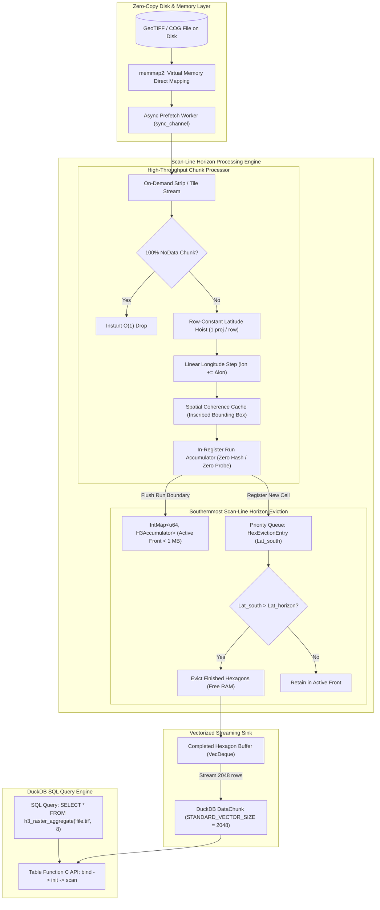

# raster_h3: High-Performance DuckDB Extension for Raster-to-H3 Aggregation

A fast, native DuckDB loadable extension written in Rust to aggregate geospatial raster pixels directly into Uber H3 hexagonal grid cells.

---

## Key Features

- **Pure Rust Engine**: Built with [`h3o`](https://crates.io/crates/h3o) and [`proj4rs`](https://crates.io/crates/proj4rs) for high performance with zero external C/C++ dependencies.
- **Zero-Copy Memory-Mapped I/O (`memmap2`)**: Direct kernel-to-user memory mapping eliminating `read()` syscalls and user buffer copies.
- **Row-Constant Latitude Hoisting**: Hoists transcendental projection math (`atan`, `exp`) once per row, eliminating 99.8% of coordinate projection math on Web Mercator and projected rasters.
- **Linear Longitude Stepping**: Column longitudes advance via a single 1-cycle addition ($\text{lon} += \Delta \text{lon}$) per pixel.
- **In-Register Run Accumulation**: Eliminates ~98% of hash calculations and table probes by accumulating contiguous pixel spans directly in CPU registers before flushing once per boundary.
- **1-Cycle Identity Hasher (`nohash-hasher`)**: Direct bitwise bucket indexing for 64-bit H3 integer cell keys.
- **Native Typed NoData Filtering**: Evaluates integer NoData using 1-cycle integer `CMP` instructions, bypassing floating-point conversions on masked pixels.
- **Fast NoData Early-Exit & Dynamic Work-Stealing**: $\mathcal{O}(1)$ detection and instant dropping of 100% empty chunks, keeping CPU cores 100% saturated on sparse imagery.
- **Async Double-Buffered I/O Prefetching**: Background prefetch pipeline overlaps disk decompression ahead of CPU compute, eliminating I/O wait bubbles.
- **Southernmost Scan-Line Horizon Eviction**: Automatically yields finished hexagons as the raster scan front advances North-to-South. Active cell RAM stays bounded to $\mathcal{O}(\text{Scan Front Width})$ (**$< 1\text{ MB}$**) regardless of file size.
- **On-Demand Streaming Chunk I/O**: Decodes strips and tiles on-demand and frees them immediately, keeping in-flight memory bounded to $\mathcal{O}(\text{chunk size})$ (~10–30 MB) even for multi-gigabyte rasters.
- **Coordinate Reprojection to WGS84**: Fast-path analytical reprojection for EPSG:3857 (Web Mercator), identity pass-through for EPSG:4326 (WGS84), and automatic PROJ transformations for UTM and arbitrary CRS projections.
- **Vectorized Streaming**: Implements DuckDB's Table Function C API to stream result rows directly into query execution chunks with minimal memory overhead.
- **Docker Support**: Multi-stage Docker image packaging DuckDB CLI and the compiled extension ready to process GeoTIFF files out of the box.

---

## Quickstart with Docker 🐳

The easiest way to process GeoTIFFs with DuckDB and `raster_h3` is via Docker:

### 1. Build the Docker Image
```bash
docker build -t raster_h3:latest .
```

### 2. Run Interactive Session (with Demo)
```bash
# Starts DuckDB with the extension loaded and runs demo on bundled sample GeoTIFF
docker run -it raster_h3:latest
```

### 3. Process Your Own GeoTIFF Files
Mount your local directory containing GeoTIFF files into `/data`:
```bash
docker run -it -v $(pwd)/data:/data raster_h3:latest
```

Inside the DuckDB prompt:
```sql
LOAD '/extensions/libraster_h3.so';

SELECT
    h3_hex,
    round(mean, 2) AS mean_value,
    count AS pixel_count
FROM h3_raster_aggregate('/data/my_raster.tif', resolution := 8)
ORDER BY pixel_count DESC
LIMIT 10;
```

---

## SQL Usage

### 1. Load the Extension
```sql
LOAD 'target/release/libraster_h3.dylib'; -- macOS (.so on Linux, .dll on Windows)
```

### 2. Aggregate Raster Pixels into H3
```sql
-- Direct aggregation from GeoTIFF / COG at H3 resolution 8
SELECT
    h3_index,
    h3_hex,
    mean,
    count,
    min,
    max,
    sum
FROM h3_raster_aggregate('elevation.tif', resolution := 8);
```

### 3. Advanced Parameters
```sql
SELECT
    h3_hex,
    mean,
    count
FROM h3_raster_aggregate(
    'landcover_utm32n.tif',
    resolution := 9,
    source_crs := 'EPSG:32632',  -- Override raster CRS
    nodata := -9999.0,           -- Override NoData pixel value
    chunk_size := 1024           -- Configure 2D tile chunk size
)
ORDER BY count DESC;
```

### 4. Helper Scalar Functions
```sql
-- Convert integer H3 cell to string, lat, lng, or resolution
SELECT
    h3_to_string(h3_index) AS h3_str,
    h3_to_lat(h3_index) AS center_lat,
    h3_to_lng(h3_index) AS center_lng,
    h3_get_resolution(h3_index) AS res,
    mean
FROM h3_raster_aggregate('temperature.tif', 7);
```

---

## Architecture



---

## Building and Testing Locally

### Prerequisites
- [Rust](https://rustup.rs/) (edition 2021+)
- [DuckDB CLI](https://duckdb.org/)

### Build Extension
```bash
cargo build --release
```

### Run Tests
```bash
cargo test
```

---

## License
MIT License
