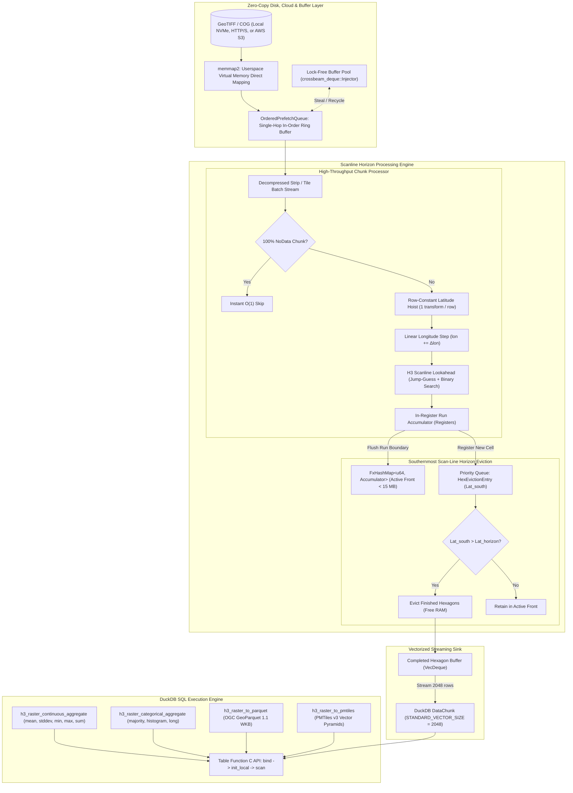

# raster_h3: High-Performance GeoTIFF-to-H3 Hexagonal Aggregation for DuckDB

[](https://opensource.org/licenses/MIT)
[](https://www.rust-lang.org)
[](https://duckdb.org)

A native DuckDB extension written in pure Rust that aggregates multi-gigabyte geospatial rasters (GeoTIFF, Cloud-Optimized GeoTIFFs) into [Uber H3](https://h3geo.org/) hexagonal grid cells — and generates cloud-native **PMTiles v3** vector pyramids for instant web visualization. All in bounded < 15 MB RAM.

Supports **continuous** surfaces (elevation, temperature, NDVI, precipitation) and **categorical** classifications (land cover, zoning, soil types) with dedicated streaming engines.

---

## 📖 Table of Contents

- [Motivation & Project Goals](#motivation--project-goals)
- [How It Works](#how-it-works)
- [Installation & Docker Quickstart](#installation--docker-quickstart)
- [SQL Usage & Practical Recipes](#sql-usage--practical-recipes)
- [Core Engineering Innovations](#core-engineering-innovations)
- [Architecture Diagram](#architecture-diagram)
- [Core Dependencies](#core-dependencies--architectural-contributions)
- [Troubleshooting & Common Pitfalls](#troubleshooting--common-pitfalls)
- [Building & Testing Locally](#building--testing-locally)
- [License](#license)

**📖 Deep Dives:**
[Engineering Details](docs/engineering.md) · [Super-Sampling](docs/super-sampling.md) · [CRS & Projections](docs/crs-and-projection.md) · [Multi-Resolution Pyramids](docs/multi-resolution.md) · [PMTiles v3](docs/pmtiles.md) · [Architecture Comparison](docs/architecture-comparison.md) · [API Reference](docs/api-reference.md)

---

## Motivation & Project Goals

### The Problem: The Raster-Tabular Divide

Geospatial data exists in two incompatible formats:

1. **Tabular / Vector Data**: Points, polygons, GPS traces, and demographic records in relational databases (DuckDB, Snowflake, BigQuery, PostgreSQL).
2. **Raster Grids**: 2D pixel matrices in GeoTIFF files — satellite imagery, elevation models, climate grids, land cover maps.

Joining raster values (elevation, temperature, land cover) with business entities (customers, routes, parcels) has traditionally required complex, slow, memory-intensive ETL pipelines.

### The Solution: Uber H3 Discrete Global Grid System

The **Uber H3 Index** divides the Earth into a hierarchical hexagonal grid with uniform neighbor adjacency and minimal area distortion. By converting raster pixels into H3 cell indices (`UBIGINT` / `VARCHAR`), spatial grids become standard relational tables joinable via `JOIN ON r.h3_index = v.h3_index`.

### Project Goals

- **Zero Python / Zero GDAL C++ Dependencies** — Pure Rust compiled into a single native dynamic library (`.dylib`, `.so`, `.dll`).
- **Bounded Constant Memory** — O(Scan Front) < 15 MB RAM regardless of file size.
- **Hardware-Saturating Multi-Core Throughput** — Maximizes CPU throughput across all available cores via Rayon work-stealing and DuckDB thread distribution.
- **Native PMTiles v3 Export** — Single-file vector tile archives with zero intermediate files, zero `tippecanoe`, and strict H3 validity enforcement.
- **Native OGC GeoParquet 1.1 Export** — 125-byte closed WKB polygon geometries with embedded PROJJSON metadata.
- **Cloud-Native COG & S3 Streaming** — Async chunk-range prefetching and request coalescing for remote rasters.
- **Sub-Pixel Super-Sampling** — RGSS, Hexagonal, Gaussian PSF, and 8-Rooks anti-aliasing for exact boundary aggregation.

---

## How It Works

Traditional tools struggle with large rasters. Here is how `raster_h3` solves each bottleneck:

| Step | Traditional Approach | raster_h3 Approach |
| :--- | :--- | :--- |
| **Memory** | Load entire raster into RAM | Stream 1 thin row at a time (< 15 MB) |
| **Projection** | Recalculate spherical math per pixel | Row-constant hoisting: 1 transform per row |
| **H3 Lookup** | Recompute cell ID per pixel | Scanline lookahead: jump-guess + binary search |
| **Eviction** | Hold all results until file completion | Evict finished hexagons immediately via horizon scan |
| **Web Tiling** | C++ Tippecanoe + scratch files + tile servers | Generate `.pmtiles` archives in 1 step |

### The Moving Scanner Front (Constant Memory)

`raster_h3` reads the image like a document scanner — one thin row at a time from North to South. When a row passes the southernmost boundary of a hexagon, that hexagon is sealed and streamed directly into query results. Memory stays bounded at < 15 MB whether the raster is 10 MB or 500 GB.

### Latitude "Cruise Control" (Eliminating 99.8% of Math)

Every pixel in a row shares the same latitude. Rather than running spherical trigonometry millions of times, `raster_h3` computes latitude once per row and steps across with simple arithmetic — eliminating 99.8% of coordinate projection math.

### Hexagon Lookahead & Run-Skipping

When entering a hexagon, the algorithm estimates its span from previous hexagons and verifies the destination. Convexity guarantees that all intermediate pixels belong to the same cell. Boundary crossings are resolved via binary search in O(log N) steps, reducing expensive trig from ~30 to ~6 operations per hexagon.

### In-Database Streaming (No Intermediate Files)

`raster_h3` runs directly inside DuckDB, streaming results into your SQL queries, joins, and Parquet exports — zero intermediate files.

### Direct Web-Ready Map Tiles

Generates single-file **PMTiles v3** vector pyramids ready for MapLibre GL, Kepler.gl, or Felt — no Tippecanoe, no GeoJSON scratch files, no tile servers.

---

## Installation & Docker Quickstart

### Pre-Compiled Binaries

Pre-compiled binaries are published for all major platforms:

| Platform | Compatible Environments | Asset Filename |
| :--- | :--- | :--- |
| **`osx_arm64`** | macOS Apple Silicon (M1/M2/M3/M4) | `raster_h3-osx_arm64.duckdb_extension.gz` |
| **`osx_amd64`** | macOS Intel x86_64 | `raster_h3-osx_amd64.duckdb_extension.gz` |
| **`linux_amd64`** | Ubuntu, Debian, CentOS, Fedora (glibc) | `raster_h3-linux_amd64.duckdb_extension.gz` |
| **`linux_amd64_musl`** | Alpine Linux, musl-based containers | `raster_h3-linux_amd64_musl.duckdb_extension.gz` |
| **`linux_arm64`** | AWS Graviton, Raspberry Pi 4/5, AArch64 | `raster_h3-linux_arm64.duckdb_extension.gz` |
| **`windows_amd64`** | Windows 10/11, Windows Server (x64) | `raster_h3-windows_amd64.duckdb_extension.gz` |

#### Option A: Install via Release URL

```sql
SET allow_unsigned_extensions = true;

-- Replace <platform> with your platform identifier (e.g. osx_arm64)
INSTALL 'https://github.com/dmuldrew/raster_h3_hexification/releases/latest/download/raster_h3-<platform>.duckdb_extension.gz';
LOAD 'raster_h3';

SELECT raster_h3_version();
```

#### Option B: Install via Custom Repository

```sql
SET allow_unsigned_extensions = true;
SET custom_extension_repository = 'https://github.com/dmuldrew/raster_h3_hexification/releases/latest/download';
INSTALL raster_h3;
LOAD raster_h3;
```

#### Option C: Manual Download & Local Load

Download from [Releases](https://github.com/dmuldrew/raster_h3_hexification/releases), then:
```sql
LOAD '/path/to/raster_h3-<platform>.duckdb_extension';
```

---

### Docker Quickstart

#### Build the Container
```bash
docker build -t raster_h3:latest .
```

#### Run Interactive Session
```bash
docker run -it raster_h3:latest
```

#### Run SQL 1-Liners
```bash
# Continuous raster aggregation
docker run --rm -v $(pwd):/data raster_h3:latest \
  "SELECT h3_hex, round(mean, 2) AS avg_elevation, count FROM h3_raster_continuous_aggregate('/data/sample_sf.tif', resolution := 8) LIMIT 5;"

# Categorical aggregation
docker run --rm -v $(pwd):/data raster_h3:latest \
  "SELECT h3_hex, majority_class, round(majority_fraction * 100, 1) AS dominance_pct, total_count FROM h3_raster_categorical_aggregate('/data/sample_sf.tif', resolution := 8) LIMIT 5;"

# PMTiles v3 export
docker run --rm -v $(pwd):/data raster_h3:latest \
  "SELECT * FROM h3_raster_to_pmtiles('/data/sample_sf.tif', '/data/sample_sf.pmtiles', min_resolution := 6, max_resolution := 8);"
```

#### Pipe SQL Scripts
```bash
cat my_analysis.sql | docker run --rm -i -v $(pwd):/data raster_h3:latest
```

#### Standalone CLI Converters
```bash
# GeoTIFF → PMTiles
docker run --rm -v $(pwd):/data raster_h3:latest \
  raster_to_pmtiles \
    --input /data/sample_sf.tif \
    --output /data/sample_sf.pmtiles \
    --resolutions 6,7,8 \
    --sampling rgss

# Parquet → PMTiles
docker run --rm -v $(pwd):/data raster_h3:latest \
  parquet_to_pmtiles \
    --input /data/demographics_h3.parquet \
    --output /data/demographics.pmtiles \
    --h3-col h3_index
```

#### Launch the PMTiles Web Viewer

Using Docker Compose (recommended):
```bash
docker compose up viewer        # foreground
docker compose up -d viewer     # detached
```

Using standalone Docker:
```bash
docker run --rm -p 8080:8080 -v $(pwd):/app python:3.11-slim python3 -u /app/pmtiles_viewer/server.py 8080
```

Open **`http://localhost:8080/pmtiles_viewer/`** to visualize any `.pmtiles` file.

---

## SQL Usage & Practical Recipes

### Load the Extension
```sql
LOAD 'target/release/libraster_h3.dylib'; -- macOS (.so on Linux, .dll on Windows)
```

### Basic Continuous Aggregation
```sql
SELECT h3_index, h3_hex, mean, count, min, max, sum
FROM h3_raster_continuous_aggregate('elevation.tif', resolution := 8);
```

### Advanced Parameters
```sql
SELECT
    h3_hex,
    round(mean, 2) AS avg_temp_c,
    round(count, 2) AS weighted_pixel_count
FROM h3_raster_continuous_aggregate(
    'temperature_global.tif',
    resolution := 9,
    source_crs := 'EPSG:4326',
    nodata := -9999.0,
    sampling := 'rgss',
    min_lon := -122.50, min_lat := 37.70,
    max_lon := -122.35, max_lat := 37.85
)
ORDER BY weighted_pixel_count DESC;
```

### Helper Scalar Functions
```sql
SELECT
    h3_to_string(h3_index) AS h3_str,
    string_to_h3('8828308281fffff') AS h3_int,
    h3_to_lat(h3_index) AS center_lat,
    h3_to_lng(h3_index) AS center_lng,
    h3_get_resolution(h3_index) AS res,
    mean
FROM h3_raster_continuous_aggregate('elevation.tif', 8);
```

### Spatial Joins
```sql
SELECT
    r.h3_hex,
    r.mean AS avg_elevation,
    p.total_population,
    p.median_income
FROM h3_raster_continuous_aggregate('california_elevation.tif', resolution := 8) r
JOIN population_h3_table p ON r.h3_index = p.h3_index
WHERE r.mean > 500.0;
```

### Export to GeoParquet
```sql
COPY (
    SELECT h3_index, h3_hex, mean, count, min, max,
           h3_to_lat(h3_index) AS centroid_lat,
           h3_to_lng(h3_index) AS centroid_lng
    FROM h3_raster_continuous_aggregate('elevation.tif', resolution := 8, sampling := 'rgss')
) TO 'elevation_h3.parquet' (FORMAT PARQUET, COMPRESSION ZSTD);
```

### Remote COG & S3 Streaming
```sql
-- HTTPS
SELECT * FROM h3_raster_continuous_aggregate(
    'https://example.com/rasters/cog_elevation.tif',
    resolution := 8, sampling := 'rgss'
);

-- AWS S3
SELECT * FROM h3_raster_continuous_aggregate(
    's3://my-geospatial-bucket/landsat/scene_01.tif',
    resolution := 9
);
```

### Multi-File Mosaics
```sql
-- Voronoi cutline partitioning (zero double-counting)
SELECT * FROM h3_raster_continuous_aggregate(
    'tiles/tile_*.tif', resolution := 8, overlap_rule := 'cutline'
);

-- Painter's Algorithm (first tile takes precedence)
SELECT * FROM h3_raster_categorical_aggregate(
    'tile_west.tif,tile_east.tif', resolution := 8, overlap_rule := 'first'
);
```

### Spectral Indices (NDVI, NBR, NDWI, EVI)
```sql
SELECT * FROM h3_raster_continuous_aggregate(
    'sentinel2_l2a.tif', resolution := 9, formula := 'ndvi'
);
```

### Categorical Aggregation

#### Majority Class & Dominance (Wide Format)
```sql
SELECT h3_hex, majority_class,
       round(majority_fraction * 100, 1) AS dominance_pct,
       unique_classes, total_count, histogram
FROM h3_raster_categorical_aggregate('worldcover_2021.tif', resolution := 8);
```

#### JSON Histogram Queries
```sql
SELECT h3_hex, majority_class,
       json_extract(histogram, '$."10"') AS forest_fraction,
       json_extract(histogram, '$."50"') AS urban_fraction
FROM h3_raster_categorical_aggregate('worldcover_2021.tif', resolution := 8)
WHERE json_extract(histogram, '$."50"') IS NOT NULL;
```

#### Long-Form Filtering
```sql
SELECT h3_hex, category AS urban_class, count AS urban_pixel_count,
       round(fraction * 100, 2) AS urban_coverage_pct
FROM h3_raster_categorical_aggregate('worldcover_2021.tif', resolution := 8, format := 'long')
WHERE category = 50 AND fraction >= 0.25
ORDER BY fraction DESC;
```

### PMTiles v3 Export
```sql
SELECT * FROM h3_raster_to_pmtiles(
    'california_elevation.tif', 'california_elevation.pmtiles',
    min_resolution := 6, max_resolution := 8, sampling := 'rgss'
);
```

### Python, Node.js, and R Integration

#### Python
```python
import duckdb

con = duckdb.connect(config={'allow_unsigned_extensions': 'true'})
con.load_extension('target/release/libraster_h3.dylib')

df = con.execute("""
    SELECT h3_hex, round(mean, 2) AS mean_elevation, count AS pixel_count
    FROM h3_raster_continuous_aggregate('california_elevation.tif', resolution := 8, sampling := 'rgss')
    ORDER BY pixel_count DESC LIMIT 10;
""").df()

print(df)
```

#### Node.js
```javascript
const duckdb = require('duckdb');
const db = new duckdb.Database(':memory:', { allow_unsigned_extensions: 'true' });

db.all("LOAD 'target/release/libraster_h3.dylib';", (err) => {
  if (err) throw err;
  db.all(`SELECT h3_hex, round(mean, 2) AS avg_elevation, count
    FROM h3_raster_continuous_aggregate('california_elevation.tif', resolution := 8) LIMIT 5;`,
    (err, rows) => { if (err) throw err; console.table(rows); });
});
```

#### R
```r
library(DBI); library(duckdb)
con <- dbConnect(duckdb::duckdb(), config = list("allow_unsigned_extensions" = "true"))
dbExecute(con, "LOAD 'target/release/libraster_h3.dylib';")
res <- dbGetQuery(con, "SELECT h3_hex, majority_class, majority_fraction, total_count
    FROM h3_raster_categorical_aggregate('worldcover_2021.tif', resolution := 8) LIMIT 10;")
print(res)
```

> 📖 **Full API Reference** — See [docs/api-reference.md](docs/api-reference.md) for complete parameter tables, output schemas, and mathematical definitions for all functions.

---

## Core Engineering Innovations

`raster_h3` achieves near-hardware-limit throughput through these architectural principles:

| # | Engineering Pillar | Impact |
| :---: | :--- | :--- |
| 1 | **Southernmost Scan-Line Horizon Eviction** | RAM bounded < 15 MB regardless of file size |
| 2 | **H3 Scanline Lookahead Algorithm** | 4× reduction in spherical trig operations |
| 3 | **Row-Constant Latitude Hoisting** | Projection transforms evaluated once per row, not per pixel |
| 4 | **Linear Longitude Stepping** | Column coordinates advance via single-cycle additions |
| 5 | **In-Register Run Accumulation** | ~98% fewer hash table lookups |
| 6 | **Branchless Hardware Min/Max** | Zero branch misprediction penalties (`minsd`/`maxsd`) |
| 7 | **Zero-Copy `memmap2` & Async Prefetching** | Direct virtual memory mapping with background decompression |
| 8 | **Zero-Allocation Hex Formatting** | Stack-based 16-byte LUT for H3 index formatting |
| 9 | **ROI Bounding Box Chunk Pruning** | Non-intersecting chunks skipped before decompression |
| 10 | **Native DuckDB Parallelism (`init_local`)** | Work-stealing chunk distribution across all CPU threads |
| 11 | **Lock-Free Buffer Pool** | Zero-allocation buffer recycling via `crossbeam_deque::Injector` |
| 12 | **Single-Hop In-Order Prefetcher** | Direct worker-to-ring-buffer queue, zero context switches |
| 13 | **Cloud-Native COG & Mosaic Ingestion** | Async HTTP/S3 range prefetching with Voronoi cutline blending |
| 14 | **Native OGC GeoParquet 1.1 Exporter** | 125-byte WKB polygons with embedded PROJJSON metadata |

> 📖 **Detailed explanations** of each innovation — See [docs/engineering.md](docs/engineering.md)

---

## Architecture Diagram



---

## Core Dependencies & Architectural Contributions

| Dependency | Purpose | Contribution |
| :--- | :--- | :--- |
| [`h3o`](https://crates.io/crates/h3o) `v0.6` | Pure-Rust H3 Engine | 100% Rust H3 DGGS — no C/C++ FFI overhead |
| [`memmap2`](https://crates.io/crates/memmap2) `v0.9` | Virtual Memory I/O | Zero-copy GeoTIFF mapping with sequential readahead |
| [`crossbeam-deque`](https://crates.io/crates/crossbeam-deque) `v0.8` | Lock-Free Buffer Pool | Concurrent work-stealing buffer recycling |
| [`libdeflater`](https://crates.io/crates/libdeflater) `v1.23` | SIMD Deflate | Hardware-accelerated decompression (AVX-512, NEON) |
| [`weezl`](https://crates.io/crates/weezl) `v0.1` | LZW Decoder | Fast streaming LZW for legacy GeoTIFFs |
| [`parquet`](https://crates.io/crates/parquet) `v53` | GeoParquet Engine | Streaming row-group writer with OGC GeoParquet 1.1 |
| [`tiff`](https://crates.io/crates/tiff) `v0.9` | GeoTIFF Decoder | Baseline TIFF, tiled TIFF, and BigTIFF support |
| [`proj4rs`](https://crates.io/crates/proj4rs) `v0.1` | Geodetic Reprojection | Pure-Rust PROJ.4 (UTM, Lambert, Albers → WGS84) |
| [`fxhash`](https://crates.io/crates/fxhash) `v0.2` | Fast Hasher | Near-identity-hash for 64-bit H3 cell keys |
| [`rayon`](https://crates.io/crates/rayon) `v1.10` | Work-Stealing Parallelism | Lock-free data parallelism across CPU cores |
| [`flate2`](https://crates.io/crates/flate2) `v1.0` | Tile Compression | Gzip for MVT payloads and PMTiles directories |
| [`thiserror`](https://crates.io/crates/thiserror) & [`serde`](https://crates.io/crates/serde) | Error & Serialization | Typed error propagation and JSON formatting |

---

## Troubleshooting & Common Pitfalls

### Unsigned Extension Loading Errors

`Error: Extension ".../libraster_h3.dylib" is not signed by DuckDB`

**Resolution**: Launch DuckDB with `-unsigned`, or set the config flag before loading:

```python
con = duckdb.connect(config={'allow_unsigned_extensions': 'true'})
con.load_extension('target/release/libraster_h3.dylib')
```

### Missing or Non-Standard CRS

If a GeoTIFF lacks embedded projection tags, `raster_h3` halts with:
```
CRS transformation error: No CRS detected in raster metadata. A CRS must be specified explicitly.
```

This prevents silent spatial corruption — meter-based coordinates treated as degrees would place hexagons in the wrong location. Specify the CRS explicitly:

```sql
SELECT * FROM h3_raster_continuous_aggregate(
    'unprojected_grid.tif', resolution := 8, crs := 'EPSG:32610'
);
```

### Antimeridian Crossing

For datasets spanning ±180° longitude, `raster_h3` automatically wraps coordinates. For ROI bounding box filters across the antimeridian, split into two queries (e.g., `[170.0, 180.0]` and `[-180.0, -170.0]`).

### BigTIFF & Codec Compatibility

Natively decodes TIFF 6.0 and BigTIFF (>4 GB) with: Raw, Deflate (Zlib), LZW, PackBits compression and `Float32/64`, `UInt8/16/32`, `Int8/16/32` pixel types. For unsupported codecs (JPEG2000, WebP, LERC), convert first:

```bash
gdal_translate -co COMPRESS=DEFLATE input.tif output.tif
```

### Container Memory Mapping

`raster_h3` uses `memmap2` for virtual memory mapping. Ensure container runtimes allow `mmap` system calls.

---

## Building & Testing Locally

### Prerequisites
- [Rust](https://rustup.rs/) (Edition 2021+, stable toolchain)
- [DuckDB CLI](https://duckdb.org/) (Version 1.0.0+)

### Build
```bash
cargo build --release
```
Outputs: `target/release/libraster_h3.dylib` (macOS) / `.so` (Linux) / `.dll` (Windows)

### Test
```bash
cargo test --release

# Or in Docker
docker run --rm -v "$(pwd)":/build -w /build rust:bookworm cargo test --release
```

### Profilers & Examples
```bash
cargo run --release --example benchmark_bottleneck path/to/raster.tif
cargo run --release --example benchmark_scaling
cargo run --release --example raster_to_pmtiles -- --input data/sample_sf.tif --output data/sample_sf.pmtiles
```

---

## License

This project is licensed under the [MIT License](LICENSE).
