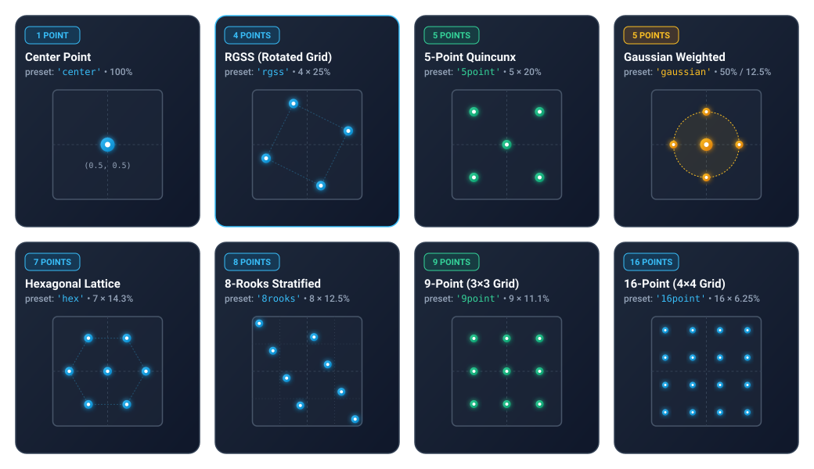
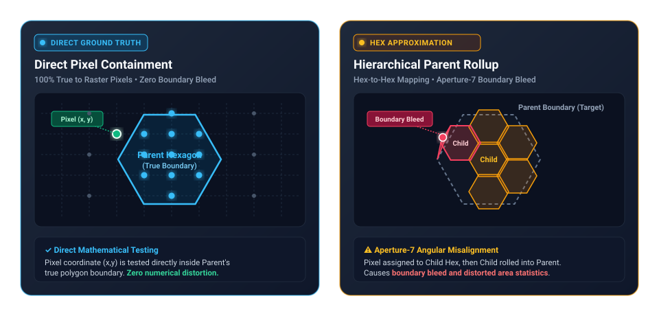
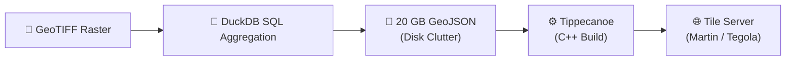
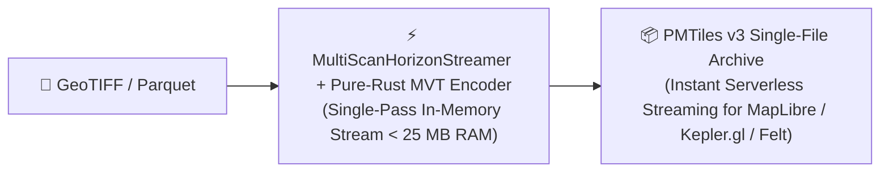
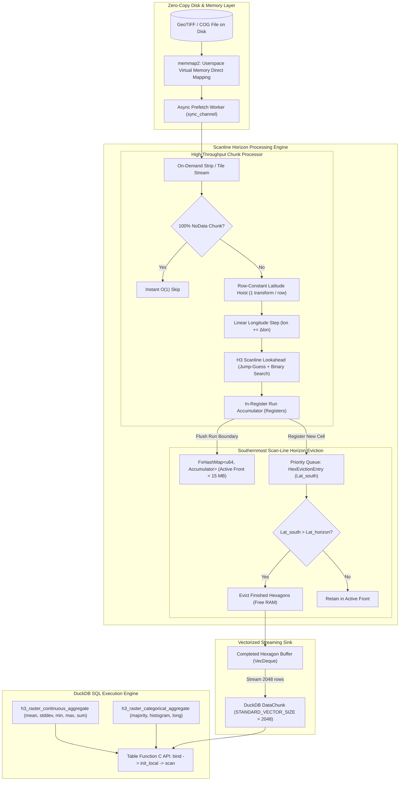

# raster_h3: High-Performance GeoTIFF-to-H3 Hexagonal Aggregation for DuckDB

[](https://opensource.org/licenses/MIT)
[](https://www.rust-lang.org)
[](https://duckdb.org)

A high-performance, native DuckDB loadable extension written in pure Rust that aggregates multi-gigabyte geospatial raster files (GeoTIFF, Cloud-Optimized GeoTIFFs) directly into Uber H3 hexagonal grid cells and generates cloud-native **PMTiles v3** multi-resolution vector pyramids for instant web visualization.

Supports both **continuous** raster surfaces (elevation, temperature, NDVI, precipitation) and **categorical** classification rasters (land cover, zoning, soil types) with dedicated streaming engines.

---

## 📖 Table of Contents
- [1. Motivation & Project Goals](#1-motivation--project-goals)
- [2. Conceptual Overview: Why Traditional Tools Struggle & How We Fix It](#2-conceptual-overview-why-traditional-tools-struggle--how-we-fix-it)
- [3. Pre-Compiled Extension Installation & Docker Quickstart](#3-pre-compiled-extension-installation--docker-quickstart-)
- [4. SQL Usage & Practical Recipes](#4-sql-usage--practical-recipes)
- [5. Core Engineering Innovations](#5-core-engineering-innovations)
- [6. Sub-Pixel Super-Sampling Guide](#6-sub-pixel-super-sampling-guide)
- [7. Supported Coordinate Reference Systems (CRS)](#7-supported-coordinate-reference-systems-crs)
  - [Optimal Raster Format & Projection: Achieving Maximum Ingestion Speed](#optimal-raster-format--projection-achieving-maximum-ingestion-speed)
- [8. Direct Ground-Truth Multi-Resolution Spatial Pyramids](#8-direct-ground-truth-multi-resolution-spatial-pyramids)
- [9. Native PMTiles v3 Vector Hexagon Pyramids](#9-native-pmtiles-v3-vector-hexagon-pyramids)
- [10. Architectural Comparison with Other Approaches](#10-architectural-comparison-with-other-approaches)
  - [Execution Environments: Local Native vs. Cloud vs. Containerized](#execution-environments-local-native-vs-cloud-vs-containerized)
- [11. Complete API Reference](#11-complete-api-reference)
- [12. Architecture Diagram](#12-architecture-diagram)
- [13. Core Dependencies & Architectural Contributions](#13-core-dependencies--architectural-contributions)
- [14. Troubleshooting & Common Pitfalls](#14-troubleshooting--common-pitfalls)
- [15. Building & Testing Locally](#15-building--testing-locally)
- [16. License](#16-license)

---

## 1. Motivation & Project Goals

### The Problem: The Raster-Tabular Divide in Geospatial Analytics
Geospatial data generally exists in two incompatible formats:
1. **Tabular / Vector Data**: Points, polygons, GPS traces, telemetry, and demographic census records stored in relational databases and data warehouses (e.g. DuckDB, Snowflake, BigQuery, PostgreSQL).
2. **Raster Grids**: Stored as 2D pixel matrices in GeoTIFF files, encompassing both:
   - **Continuous surfaces**: Multi-spectral satellite imagery (Sentinel-2, Landsat), Digital Elevation Models (SRTM, 3DEP), climate grids (ERA5, PRISM), and weather forecasts.
   - **Categorical classifications**: Land cover maps (ESA WorldCover, NLCD, CORINE), soil type grids, biome zones, and urban zoning layers.

Joining raster values (e.g. elevation, temperature, land cover class) with business entities (e.g. customers, delivery routes, real estate parcels, cell towers) has traditionally required complex, slow, and memory-intensive ETL pipelines in Python or specialized GIS software.

### The Solution: Uber H3 Discrete Global Grid System (DGGS)
The **Uber H3 Index** divides the Earth's surface into a hierarchical hexagonal grid. Hexagons have uniform neighbor adjacency (each hexagon has exactly 6 equidistant neighbors) and minimal area distortion.

By converting continuous raster pixels into discrete H3 cell indices (`UBIGINT` / `VARCHAR`), spatial grids become standard relational tables. You can join elevation, climate, and imagery directly with business tables using standard `JOIN ON r.h3_index = v.h3_index` queries inside SQL.

### Project Goals
- **Zero Python / Zero GDAL C++ Dependencies**: A pure Rust engine compiled into a single self-contained native dynamic library (`.dylib`, `.so`, `.dll`).
- **Bounded Constant Memory (O(Scan Front) < 15 MB RAM)**: Processes multi-gigabyte and multi-terabyte rasters on standard laptops without out-of-memory (OOM) crashes.
- **Hardware-Saturating Multi-Core Throughput**: Maximizes CPU throughput by saturating disk and decompression pipelines across all available cores with linear Rayon and DuckDB thread distribution.
- **Native PMTiles v3 Vector Pyramid Generation**: Converts raster aggregations directly into single-file Mapbox Vector Tile (`.pmtiles`) archives with zero intermediate GIS files, zero external `tippecanoe` builds, and strict mathematical H3 validity enforcement.
- **Native OGC GeoParquet 1.1 Export**: Converts continuous or categorical aggregations directly to GeoParquet with 125-byte closed WKB polygon geometries and embedded PROJJSON metadata.
- **Cloud-Native Remote COG & S3 Streaming**: Directly streams Cloud-Optimized GeoTIFFs over HTTP, HTTPS, or AWS S3 with asynchronous chunk range prefetching and request coalescing.
- **Native H3 Parquet to PMTiles Conversion**: Converts any H3-indexed Parquet file directly to PMTiles v3 archives with auto-detected property schema and strict cell validation.
- **Arbitrary SQL Execution in Docker**: Runs continuous, categorical, or PMTiles export queries directly as 1-liners or piped scripts in Docker with zero manual extension loading.
- **Sub-Pixel Area-Weighted Anti-Aliasing**: Supports multi-point super-sampling (RGSS, Hexagonal, Gaussian PSF, 8-Rooks) for exact area-proportional boundary aggregation.

---

## 2. Conceptual Overview: Why Traditional Tools Struggle & How We Fix It

If you have ever tried to convert satellite imagery or elevation grids to hexagons using Python (`rasterio` + `h3-py`) or GIS software, you have likely encountered long processing times and out-of-memory (OOM) crashes.

Here is why traditional tools struggle, and how `raster_h3` solves the problem:

| Step | Traditional Approach | raster_h3 Approach |
| :--- | :--- | :--- |
| 1. Memory | Load entire multi-gigabyte raster into RAM | Stream 1 thin row at a time (&lt; 15 MB RAM) |
| 2. Projection | Re-calculate spherical GPS math on every pixel | Set "Cruise Control" (1 projection calculation per row) |
| 3. H3 Lookup | Recompute cell ID or search hash table per pixel | Scanline Lookahead: Jump-guess + binary search (O(log N)) |
| 4. Eviction | Hold all results in memory until file completion | Evict finished hexagons from memory immediately via horizon scan |
| 5. Web Tiling | Run C++ Tippecanoe, write scratch files & setup tile servers | Generate cloud-native .pmtiles vector archives in 1 step |
| **Outcome** | Heavy RAM footprint & multi-stage ETL scripts | Fast, bounded &lt; 15 MB RAM & instant SQL querying |

### 1. The Moving Scanner Front (Constant Memory)
Instead of loading a multi-gigabyte file into memory, `raster_h3` reads the image like an office document scanner—one paper-thin row at a time from North to South. The moment a row moves past the southernmost boundary of a hexagon, that hexagon is sealed, finished, and streamed directly into your SQL query results.
* **The Benefit**: Your computer never holds more than a few kilobytes in memory (< 15 MB RAM), whether your raster is 10 megabytes or 500 gigabytes.

### 2. Latitude "Cruise Control" (Eliminating 99.8% of Math)
Every pixel in a horizontal row shares the exact same latitude coordinate. Rather than running heavy spherical trigonometry millions of times, `raster_h3` calculates the latitude once at the start of the row, sets "cruise control", and simply steps across the row with lightning-fast arithmetic.
* **The Benefit**: 99.8% of the mathematical coordinate transformations are completely eliminated.

### 3. The Hexagon Superhighway (Lookahead & Run-Skipping)
Most pixels lie safely inside the interior of a hexagon rather than on its border. When `raster_h3` enters a hexagon, it estimates the span based on previous hexagons and verifies the destination. If verified, convexity guarantees that all intermediate pixels belong to that cell. When boundaries are crossed, a binary search finds the exact edge in logarithmic steps.
* **The Benefit**: Expensive spherical trigonometry operations are reduced from ~30 per hexagon down to ~6 per hexagon.

### 4. In-Database Streaming (No Intermediate Files)
Traditional pipelines require writing intermediate shapefiles or GeoTIFFs to disk, transferring data between Python and C++, and importing them into a database. `raster_h3` runs directly inside DuckDB, streaming results straight into your SQL queries, joins, and Parquet exports.
* **The Benefit**: Zero intermediate files and instant query execution.

### 5. Direct Web-Ready Map Tiles (No Tippecanoe or Servers Needed)
Visualizing massive hexagonal datasets traditionally required installing external C++ toolchains (`tippecanoe`), creating 20 GB temporary GeoJSON scratch files, and configuring backend tile server daemons (Tegola, Martin). `raster_h3` directly generates single-file **PMTiles v3** vector pyramids with built-in H3 validation, ready to drag-and-drop into MapLibre GL, Kepler.gl, or Felt.
* **The Benefit**: Instant serverless web mapping from a single SQL query.

---

## 3. Pre-Compiled Extension Installation & Docker Quickstart 📦

### 1. Direct Installation via DuckDB (No Compilation Required)
Pre-compiled binaries with native DuckDB extension footers and gzip compression are published for all major architectures on every release:

| DuckDB Architecture | Platform Identifier | Compatible Environments | Asset Filename |
| :--- | :--- | :--- | :--- |
| **`osx_arm64`** | Apple Silicon | macOS M1/M2/M3/M4 (ARM64) | `raster_h3-osx_arm64.duckdb_extension.gz` |
| **`osx_amd64`** | Intel Mac | macOS x86_64 | `raster_h3-osx_amd64.duckdb_extension.gz` |
| **`linux_amd64`** | Linux x86_64 | Ubuntu, Debian, CentOS, Fedora, Arch (glibc) | `raster_h3-linux_amd64.duckdb_extension.gz` |
| **`linux_amd64_musl`** | Linux Musl | Alpine Linux, musl-based containers | `raster_h3-linux_amd64_musl.duckdb_extension.gz` |
| **`linux_arm64`** | Linux ARM64 | AWS Graviton, Raspberry Pi 4/5, Linux AArch64 | `raster_h3-linux_arm64.duckdb_extension.gz` |
| **`windows_amd64`** | Windows x64 | Windows 10/11, Windows Server (MSVC x86_64) | `raster_h3-windows_amd64.duckdb_extension.gz` |

#### A. Install via Direct Release URL
Start DuckDB with unsigned extensions enabled (`duckdb -unsigned` or `SET allow_unsigned_extensions = true;`), then install directly:

```sql
-- Enable loading community extensions
SET allow_unsigned_extensions = true;

-- Install directly from GitHub Releases (replace <platform> with your platform identifier, e.g. osx_arm64):
INSTALL 'https://github.com/dmuldrew/raster_h3_hexification/releases/latest/download/raster_h3-<platform>.duckdb_extension.gz';

-- Load the extension
LOAD 'raster_h3';

-- Verify installation
SELECT raster_h3_version();
```

#### B. Install via Custom Extension Repository
DuckDB extensions can also be resolved automatically using DuckDB's repository layout:

```sql
SET allow_unsigned_extensions = true;
SET custom_extension_repository = 'https://github.com/dmuldrew/raster_h3_hexification/releases/latest/download';
INSTALL raster_h3;
LOAD raster_h3;
```

#### C. Manual Download & Local Load
Alternatively, download the `.duckdb_extension` (or `.duckdb_extension.gz`) file for your platform from [Releases](https://github.com/dmuldrew/raster_h3_hexification/releases) and load it directly:
```sql
LOAD '/path/to/raster_h3-<platform>.duckdb_extension';
```

---

### 2. Quickstart with Docker 🐳

The easiest way to run `raster_h3` in a container is with the bundled Dockerfile, which includes the DuckDB CLI and the pre-compiled native extension:

### 1. Build the Container
```bash
docker build -t raster_h3:latest .
```

### 2. Run Interactive Session with Demo Data
```bash
docker run -it raster_h3:latest
```

### 3. Run Direct SQL 1-Liners
You can execute any continuous, categorical, or PMTiles export query directly from your host shell without manual extension loading:

```bash
# Execute continuous raster aggregation
docker run --rm -v $(pwd):/data raster_h3:latest \
  "SELECT h3_hex, round(mean, 2) AS avg_elevation, count FROM h3_raster_continuous_aggregate('/data/sample_sf.tif', resolution := 8) LIMIT 5;"

# Execute categorical aggregation
docker run --rm -v $(pwd):/data raster_h3:latest \
  "SELECT h3_hex, majority_class, round(majority_fraction * 100, 1) AS dominance_pct, total_count FROM h3_raster_categorical_aggregate('/data/sample_sf.tif', resolution := 8) LIMIT 5;"

# Direct PMTiles v3 export from SQL
docker run --rm -v $(pwd):/data raster_h3:latest \
  "SELECT * FROM h3_raster_to_pmtiles('/data/sample_sf.tif', '/data/sample_sf.pmtiles', min_resolution := 6, max_resolution := 8);"
```

### 4. Pipe SQL Scripts via Stdin
Pipe any arbitrary SQL file or pipeline directly into DuckDB inside the container:

```bash
cat my_analysis.sql | docker run --rm -i -v $(pwd):/data raster_h3:latest
```

### 5. Interactive DuckDB Prompt with Auto-Loaded Extension
```bash
docker run -it -v $(pwd):/data raster_h3:latest
```
*(The `raster_h3` extension is pre-loaded automatically on startup.)*

### 6. Standalone CLI Converters

#### A. GeoTIFF to PMTiles:
```bash
docker run --rm -v $(pwd):/data raster_h3:latest \
  raster_to_pmtiles \
    --input /data/sample_sf.tif \
    --output /data/sample_sf.pmtiles \
    --resolutions 6,7,8 \
    --sampling rgss
```

#### B. H3 Parquet to PMTiles:
```bash
docker run --rm -v $(pwd):/data raster_h3:latest \
  parquet_to_pmtiles \
    --input /data/demographics_h3.parquet \
    --output /data/demographics.pmtiles \
    --h3-col h3_index
```

### 7. Launch the PMTiles Web Viewer with Docker
You can run the built-in HTTP byte-range server and web studio using either Docker Compose or a standalone Docker container:

#### A. Using Docker Compose (Recommended)
```bash
# Start the PMTiles viewer service
docker compose up viewer

# Or run in the background (detached mode)
docker compose up -d viewer
```

#### B. Using Standalone Docker
```bash
docker run --rm -p 8080:8080 -v $(pwd):/app python:3.11-slim python3 -u /app/pmtiles_viewer/server.py 8080
```

Once started, open **`http://localhost:8080/pmtiles_viewer/`** (or **`http://localhost:8080/`**) in your browser. Any PMTiles file in `./data/` or your mounted repository (e.g. `/data/sample_sf.pmtiles`) can be immediately loaded and streamed.

---

## 4. SQL Usage & Practical Recipes

### 1. Load the Extension Locally
```sql
LOAD 'target/release/libraster_h3.dylib'; -- macOS (.so on Linux, .dll on Windows)
```

### 2. Basic Raster Aggregation (Continuous Surfaces)
```sql
SELECT
    h3_index,
    h3_hex,
    mean,
    count,
    min,
    max,
    sum
FROM h3_raster_continuous_aggregate('elevation.tif', resolution := 8);
```

### 3. Advanced Parameters (CRS, NoData, Bounding Box, Super-Sampling)
```sql
SELECT
    h3_hex,
    round(mean, 2) AS avg_temp_c,
    round(count, 2) AS weighted_pixel_count
FROM h3_raster_continuous_aggregate(
    'temperature_global.tif',
    resolution := 9,
    source_crs := 'EPSG:4326',  -- Override raster CRS
    nodata := -9999.0,          -- Override NoData pixel value
    sampling := 'rgss',         -- Anti-aliased sub-pixel super-sampling
    min_lon := -122.50,         -- Region of Interest (ROI) bounding box
    min_lat := 37.70,           -- Prunes non-intersecting chunks upfront
    max_lon := -122.35,
    max_lat := 37.85
)
ORDER BY weighted_pixel_count DESC;
```

### 4. Helper Scalar Functions
```sql
SELECT
    h3_to_string(h3_index) AS h3_str,
    string_to_h3('8828308281fffff') AS h3_int,
    h3_to_lat(h3_index) AS center_lat,
    h3_to_lng(h3_index) AS center_lng,
    h3_get_resolution(h3_index) AS res,
    mean
FROM h3_raster_continuous_aggregate('elevation.tif', 8);
```

### 5. Spatial Joins with Vector & Demographic Tables
```sql
-- Direct 64-bit integer join (zero string conversion overhead)
SELECT
    r.h3_hex,
    r.mean AS avg_elevation,
    p.total_population,
    p.median_income
FROM h3_raster_continuous_aggregate('california_elevation.tif', resolution := 8) r
JOIN population_h3_table p ON r.h3_index = p.h3_index
WHERE r.mean > 500.0;
```

### 6. Streaming Directly to GeoParquet on Disk or Cloud (S3)
```sql
COPY (
    SELECT
        h3_index,
        h3_hex,
        mean,
        count,
        min,
        max,
        h3_to_lat(h3_index) AS centroid_lat,
        h3_to_lng(h3_index) AS centroid_lng
    FROM h3_raster_continuous_aggregate('elevation.tif', resolution := 8, sampling := 'rgss')
) TO 'elevation_h3.parquet' (FORMAT PARQUET, COMPRESSION ZSTD);
```

### 7. Remote Cloud-Optimized GeoTIFF (COG) & S3 Streaming
Stream remote rasters directly over HTTP, HTTPS, or AWS S3 without downloading the full raster to local disk:
```sql
-- Direct HTTPS COG ingestion with asynchronous byte-range prefetching
SELECT * FROM h3_raster_continuous_aggregate(
    'https://example.com/rasters/cog_elevation.tif',
    resolution := 8,
    sampling := 'rgss'
);

-- AWS S3 bucket streaming (respects standard AWS environment variables or S3 URLs)
SELECT * FROM h3_raster_continuous_aggregate(
    's3://my-geospatial-bucket/landsat/scene_01.tif',
    resolution := 9
);
```

### 8. Multi-File Raster Mosaics & Cutline Overlap Resolution
Ingest multi-tile collections via glob patterns, comma-delimited lists, or GDAL VRT files with zero double-counting:
```sql
-- Voronoi cutline bisector partitioning: zero double-counting across overlapping tiles
SELECT * FROM h3_raster_continuous_aggregate(
    'tiles/tile_*.tif',
    resolution := 8,
    overlap_rule := 'cutline'
);

-- Comma-separated list with Painter's Algorithm ('first' tile takes precedence)
SELECT * FROM h3_raster_categorical_aggregate(
    'tile_west.tif,tile_east.tif',
    resolution := 8,
    overlap_rule := 'first'
);
```

### 9. On-the-Fly Multi-Band Spectral Index Calculation (NDVI, NDWI, NBR, EVI)
Compute spectral indices directly during streaming ingestion with automatic division-by-zero protection:
```sql
-- Compute Normalized Difference Vegetation Index (NDVI) on-the-fly from multi-band imagery
SELECT * FROM h3_raster_continuous_aggregate(
    'sentinel2_l2a.tif',
    resolution := 9,
    formula := 'ndvi'
);

-- Compute Normalized Burn Ratio (NBR) for wildfire burn severity mapping
SELECT * FROM h3_raster_continuous_aggregate(
    'landsat_wildfire.tif',
    resolution := 9,
    formula := 'nbr'
);
```

### 10. Categorical Raster Aggregation (Land Cover, Zoning, Soil Types)

#### 10a. Majority Class & Dominance Percentage (Wide Format)
```sql
SELECT
    h3_hex,
    majority_class,
    round(majority_fraction * 100, 1) AS dominance_pct,
    unique_classes,
    total_count,
    histogram
FROM h3_raster_categorical_aggregate('worldcover_2021.tif', resolution := 8);
```

#### 10b. Querying the JSON Class Histogram
```sql
-- Use DuckDB's built-in JSON functions to extract specific class fractions
SELECT
    h3_hex,
    majority_class,
    json_extract(histogram, '$."10"') AS forest_fraction,
    json_extract(histogram, '$."50"') AS urban_fraction
FROM h3_raster_categorical_aggregate('worldcover_2021.tif', resolution := 8)
WHERE json_extract(histogram, '$."50"') IS NOT NULL;
```

#### 10c. Normalized Long-Form Filtering
```sql
-- Find all hexagons with >= 25% Urban (class 50) coverage
SELECT
    h3_hex,
    category AS urban_class,
    count AS urban_pixel_count,
    round(fraction * 100, 2) AS urban_coverage_pct
FROM h3_raster_categorical_aggregate('worldcover_2021.tif', resolution := 8, format := 'long')
WHERE category = 50 AND fraction >= 0.25
ORDER BY fraction DESC;
```

### 11. Native PMTiles v3 Vector Pyramid Export from DuckDB
```sql
-- Convert any GeoTIFF directly to a multi-resolution PMTiles v3 archive in a single query
SELECT * FROM h3_raster_to_pmtiles(
    'california_elevation.tif',
    'california_elevation.pmtiles',
    min_resolution := 6,
    max_resolution := 8,
    sampling := 'rgss'
);
```

### 12. Python, Node.js, and R Integration Recipes

`raster_h3` can be loaded dynamically in any DuckDB client library:

#### Python (`duckdb` package)
```python
import duckdb

# Initialize DuckDB connection with unsigned extensions enabled
con = duckdb.connect(config={'allow_unsigned_extensions': 'true'})

# Load the compiled dynamic library
con.load_extension('target/release/libraster_h3.dylib')  # .so on Linux, .dll on Windows

# Execute aggregation query directly into a Pandas or Polars DataFrame
df = con.execute("""
    SELECT 
        h3_hex, 
        round(mean, 2) AS mean_elevation, 
        round(stddev, 2) AS ruggedness, 
        count AS pixel_count
    FROM h3_raster_continuous_aggregate('california_elevation.tif', resolution := 8, sampling := 'rgss')
    ORDER BY pixel_count DESC
    LIMIT 10;
""").df()

print(df)
```

#### Node.js (`duckdb` package)
```javascript
const duckdb = require('duckdb');
const db = new duckdb.Database(':memory:', { allow_unsigned_extensions: 'true' });

db.all("LOAD 'target/release/libraster_h3.dylib';", (err) => {
  if (err) throw err;
  
  db.all(`
    SELECT h3_hex, round(mean, 2) AS avg_elevation, count
    FROM h3_raster_continuous_aggregate('california_elevation.tif', resolution := 8)
    LIMIT 5;
  `, (err, rows) => {
    if (err) throw err;
    console.table(rows);
  });
});
```

#### R (`duckdb` + `DBI` packages)
```r
library(DBI)
library(duckdb)

con <- dbConnect(duckdb::duckdb(), config = list("allow_unsigned_extensions" = "true"))
dbExecute(con, "LOAD 'target/release/libraster_h3.dylib';")

res <- dbGetQuery(con, "
    SELECT h3_hex, majority_class, majority_fraction, total_count
    FROM h3_raster_categorical_aggregate('worldcover_2021.tif', resolution := 8)
    LIMIT 10;
")
print(res)
```

---

## 5. Core Engineering Innovations

`raster_h3` achieves hardware limits through several key architectural principles:

| # | Engineering Pillar | Description & Impact |
| :---: | :--- | :--- |
| 1 | **Southernmost Scan-Line Horizon Eviction** | RAM stays < 15 MB regardless of file size by sealing completed hexagons as scanlines pass their southern vertices. |
| 2 | **H3 Scanline Lookahead Algorithm** | Jumps ahead along the scanline using previous hexagon widths and binary searches boundary crossings, cutting spherical trig operations by 4x. |
| 3 | **Row-Constant Latitude Hoisting** | Evaluates transcendental projection transforms (`atan`, `exp`, PROJ) once per row rather than per pixel. |
| 4 | **Linear Longitude Stepping** | Advances column coordinates via single 1-cycle additions (lon += delta_lon). |
| 5 | **In-Register Run Accumulation** | Contiguous pixels within the same H3 cell update running statistics in CPU registers, eliminating ~98% of hash table lookups. |
| 6 | **Branchless Hardware Min/Max** | Replaces conditional branches with `minsd`/`maxsd` instructions with zero branch mispredictions. |
| 7 | **Zero-Copy `memmap2` & Async Prefetching** | Maps GeoTIFFs into userspace virtual memory with asynchronous background chunk decompression. |
| 8 | **Zero-Allocation Fast Hex Formatting** | Formats 64-bit integer H3 indices into lowercase hexadecimal ASCII bytes using a 16-byte stack LUT. |
| 9 | **ROI Bounding Box Chunk Pruning** | Skips non-intersecting raster chunks upfront before reading or decompressing data from disk. |
| 10 | **Native DuckDB Parallelism (`init_local`)** | Dynamically distributes raster chunks across all CPU worker threads with accurate optimizer cardinality. |
| 11 | **Lock-Free Work-Stealing Buffer Pool** | Work-stealing buffer injector (`crossbeam_deque::Injector`) eliminates buffer allocation churn across 15,840+ chunks. |
| 12 | **Single-Hop Bounded In-Order Prefetcher** | Direct worker-to-ring-buffer queue eliminates intermediate OS thread context switches with zero-allocation batch drains. |
| 13 | **Cloud-Native COG & Mosaic Ingestion** | Asynchronous HTTP/S3 range prefetching and multi-file Voronoi cutline mosaic blending with zero double-counting. |
| 14 | **Native OGC GeoParquet 1.1 Exporter** | Direct streaming export of 125-byte WKB polygon geometries with embedded PROJJSON `OGC:CRS84` metadata. |

### 1. Southernmost Scan-Line Horizon Eviction
Because GeoTIFF raster scanlines are ordered North-to-South (decreasing latitude), any H3 hexagon whose southernmost vertex is north of the current scan line can **never receive another pixel**. 
- Finished hexagons are immediately evicted from the hash map and streamed into DuckDB vector chunks.
- Active memory remains strictly bounded to O(Scan Front Width) (**< 15 MB RAM**), allowing a standard laptop to seamlessly process a 500 GB global raster.

### 2. H3 Scanline Lookahead Algorithm
To process pixels at maximum throughput, `raster_h3` avoids calculating exact spherical trigonometry (H3 coordinates) for every single pixel. Instead, it uses a **Scanline Lookahead** algorithm that exploits the geometric convexity of hexagons:
1. **The Jump Guess**: As the scanline moves horizontally across the raster, it remembers the width (in pixels) of the previously processed hexagon. It guesses the current hexagon will be the same width and jumps ahead by that exact amount.
2. **Convexity Proof**: If the pixel at the jump destination is the exact same H3 cell, convexity mathematically guarantees that **all pixels skipped between the start and the destination** are also inside that hexagon. The algorithm skips trig math for the entire block.
3. **Binary Search Boundary Finding**: If the jump overshoots into an adjacent hexagon, the algorithm performs an efficient **Binary Search** between the current pixel and the overshot pixel. Because the boundary must lie between these two points, it finds the exact sub-pixel edge in O(log2(error distance)) steps.

### 3. Row-Constant Latitude Hoisting & Coordinate Hierarchy
On North-Up rasters (Web Mercator EPSG:3857, WGS84 EPSG:4326, UTM), latitude is identical across all pixels in a row.
- Transcendental projection functions (`atan`, `exp`, PROJ forward transforms) are evaluated **once per row** instead of once per pixel.
- Eliminates **99.8% of coordinate projection math**.

The transformer uses a **three-tier performance hierarchy**:
- 🟢 **Identity** (`EPSG:4326`, `EPSG:4269`): 0 cycles — coordinates pass through unchanged.
- 🟡 **Analytical** (`EPSG:3857`, `EPSG:900913`): ~5 cycles — closed-form inverse Mercator.
- 🔵 **PROJ4** (UTM, Conic, Polar via `proj4rs`): Pure-Rust reprojection pipeline evaluated once per row.

---

## 6. Sub-Pixel Super-Sampling Guide

When a raster pixel lies across the boundary between two or more H3 hexagons, single-point center sampling assigns 100% of the pixel's value to whichever cell contains the center point. 

With **Sub-Pixel Super-Sampling**, multiple sample offsets (dx_i, dy_i) are evaluated within each pixel's unit box [0, 1] x [0, 1] with fractional weights:



### Sampling Preset Reference Table

| Preset Name | Points | Weighting | Geometric Rationale | Why & When to Use |
| :--- | :---: | :--- | :--- | :--- |
| **`'center'`** *(default)* | 1 | 1.0 (Center) | Centroid evaluation | **Maximum speed**: Best when raster pixels are much smaller than H3 cells (e.g. 10m Sentinel vs Res 7 cells). |
| **`'rgss'`** / `'rotated4'` ⭐ | 4 | 0.25 each | 26.6° rotated grid (arctan 0.5) | **Best overall balance**: No two points share the same X or Y axis, eliminating collinear boundary blind spots with only 4 samples. |
| **`'hex'`** / `'7point'` | 7 | 1/7 each | Inscribed regular hexagon | **H3 Geometry Alignment**: Matches the natural hexagonal symmetry of H3 cell edges with zero directional bias. |
| **`'gaussian'`** / `'psf'` | 5 | Center 0.50, Edges 0.125 | Gaussian Point Spread Function | **Optical Sensor Emulation**: Emulates real-world satellite sensor response where the pixel center is more sensitive than the corners. |
| **`'5point'`** / `'quincunx'` | 5 | 0.20 each | Center + 4 diagonal corners | **Classic Area Weighting**: Standard 5-point super-sampling. |
| **`'8rooks'`** / `'stratified8'`| 8 | 1/8 each | Latin Hypercube non-attacking rooks | **Diagonal Anti-Aliasing**: Eliminates sample clumping along diagonal hexagon edges. |
| **`'9point'`** / `'3x3'` | 9 | 1/9 each | Regular 3 × 3 grid | **Dense Uniform Coverage**: Smooth, uniform sub-pixel discretization. |
| **`'16point'`** / `'4x4'` | 16 | 1/16 each | Regular 4 × 4 grid | **Coarse → Fine Resampling**: Ideal when coarse pixels (e.g. 1km climate / ERA5 data) overlap fine H3 cells (Res 9–11). |

### Performance & Precision Trade-Off Guide

| Sampling Mode | Samples / Pixel | Relative Runtime | Boundary Precision | Recommended Use Case |
| :--- | :---: | :---: | :--- | :--- |
| **`center`** | 1 | **$1.0\times$** (Fastest) | Baseline | Fast exploratory scans, massive high-resolution rasters (10m pixels into Res 6–8 cells) |
| **`rgss`** *(Recommended)* | 4 | **$\sim 0.75\times$** | High Anti-Aliasing | Default for production analytical queries; eliminates axis-aligned blind spots |
| **`hex`** | 7 | **$\sim 0.60\times$** | True Hexagonal Symmetry | When strict hexagonal area weighting is required |
| **`gaussian`** | 5 | **$\sim 0.68\times$** | Optical PSF Emulation | Remote sensing satellite imagery where pixel centers dominate sensor response |
| **`8rooks`** | 8 | **$\sim 0.55\times$** | Full Stratified Anti-Aliasing | Highly complex boundary contours with diagonal edges |
| **`16point`** | 16 | **$\sim 0.35\times$** | Sub-Grid Reconstruction | Coarse rasters (e.g. 1km climate grids) aggregated into fine H3 cells (Res 9–11) |

#### Performance Tuning Tips
1. **Match `chunk_size` to Tile Dimensions**: For tiled GeoTIFFs (e.g., $256 \times 256$ or $512 \times 512$ tiles), set `chunk_size := 512` to align DuckDB decompressor buffers with native TIFF block boundaries.
2. **Region of Interest (ROI) Pruning**: Always specify `min_lon`, `min_lat`, `max_lon`, `max_lat` when analyzing spatial subsets. Non-overlapping GeoTIFF blocks are discarded instantly before reading from disk.
3. **Multi-Resolution Single Passes**: When creating multi-zoom web layers, use `resolutions := [6, 7, 8]` or `h3_raster_to_pmtiles(...)` rather than separate SQL queries to read the underlying GeoTIFF only once.

---

## 7. Supported Coordinate Reference Systems (CRS)

`raster_h3` automatically detects the Coordinate Reference System (CRS) embedded in your GeoTIFF file and reprojects all pixel coordinates to WGS84 (EPSG:4326) for H3 indexing. You can also override the CRS manually via the `source_crs` parameter.

### How CRS Detection Works
1. **GeoTIFF metadata**: The extension reads the `ModelTiepointTag`, `ModelPixelScaleTag`, and `GeoKeyDirectoryTag` from the TIFF header to extract the embedded projection definition.
2. **EPSG matching**: If an EPSG code is found, the transformer selects the optimal tier (Identity → Analytical → PROJ4).
3. **PROJ string fallback**: If only a PROJ.4 definition string is present (e.g. Lambert Conformal Conic, Albers Equal-Area), it is passed directly to `proj4rs`.
4. **Manual override**: The `source_crs` parameter accepts `'EPSG:XXXX'` codes or full PROJ.4 definition strings, overriding any embedded metadata.

### Supported Projection Families

| Projection Family | Common Use Cases | Example EPSG Codes |
| :--- | :--- | :--- |
| **Geographic (lat/lon)** | Global datasets, climate grids (ERA5, PRISM) | `EPSG:4326` (WGS84), `EPSG:4269` (NAD83) |
| **Web Mercator** | Web tile services, Google/Bing/OSM basemaps | `EPSG:3857`, `EPSG:900913` |
| **UTM (Universal Transverse Mercator)** | High-resolution regional data, Sentinel-2, Landsat | `EPSG:32601`–`32660` (North), `EPSG:32701`–`32760` (South) |
| **Transverse Mercator** | National grid systems (British National Grid, GDA2020) | `EPSG:27700`, `EPSG:7856` |
| **Lambert Conformal Conic** | Continental-scale datasets, CONUS projections | `EPSG:5070` (NAD83 Conus Albers), custom PROJ strings |
| **Albers Equal-Area** | Area-preserving thematic maps, NLCD, MODIS composites | `EPSG:5070`, `EPSG:6933` |
| **Polar Stereographic** | Arctic/Antarctic datasets, sea ice, NSIDC | `EPSG:3413` (North), `EPSG:3031` (South) |

### Usage Examples
```sql
-- Auto-detect from GeoTIFF metadata (most common)
SELECT * FROM h3_raster_continuous_aggregate('sentinel2_utm32n.tif', resolution := 8);

-- Override CRS with EPSG code
SELECT * FROM h3_raster_continuous_aggregate('legacy_raster.tif', resolution := 8, source_crs := 'EPSG:32632');

-- Override with full PROJ string (Lambert Conformal Conic)
SELECT * FROM h3_raster_continuous_aggregate(
    'conus_climate.tif',
    resolution := 7,
    source_crs := '+proj=lcc +lat_1=25 +lat_2=60 +lat_0=42.5 +lon_0=-100 +datum=NAD83 +units=m'
);
```

---

### Optimal Raster Format & Projection: Achieving Maximum Ingestion Speed

While `raster_h3` can ingest arbitrary GeoTIFF files in any projected CRS (Albers, UTM, Lambert Conformal Conic), the physical layout and coordinate reference system of the source file drastically impacts processing throughput:

| Raster Format & CRS | Projection Math | Chunk Geometry | Relative Ingestion Speed | CONUS Res 9 (5-Pt) Runtime |
| :--- | :--- | :--- | :---: | :---: |
| **Striped BigTIFF (e.g. Albers EPSG:5070)** | Heavy spherical trig (`atan2`, `sqrt`, authalic) | $156\text{k} \times 1$ strips | Baseline ($1\times$) | $\approx 35 - 40\text{ minutes}$ |
| **Tiled COG (Projected CRS, e.g. Albers)** | Heavy spherical trig | $512 \times 512$ square tiles | **$\approx 2.5\times$ faster** | $\approx 12 - 16\text{ minutes}$ |
| **Tiled COG in Native WGS84 (EPSG:4326)** | **Zero trig** (Single addition: $lng \mathrel{+}= \Delta lng$) | $512 \times 512$ square tiles | **$\approx 4.5\times - 6\times$ faster** | **$\approx 6 - 8\text{ minutes}$** |

#### Why Tiled WGS84 Cloud-Optimized GeoTIFFs (COG) Are Optimal:
1. **Zero Trigonometry ("Affine Cruise Control")**: In WGS84 (`EPSG:4326`), pixel coordinates map directly to $(lng, lat)$ degrees with simple addition. All complex authalic trigonometric calculations (`atan2`, `sqrt`, series expansions) vanish, converting the coordinate step into a single CPU cycle.
2. **Dense L1/L2 Cache Locality**: A $512 \times 512$ square tile represents a localized geographic block ($\approx 15\,\text{km} \times 15\,\text{km}$). All 262,144 pixels map to a tight cluster of neighboring hexagons that fit in the CPU's high-speed L1/L2 cache, rather than scattering updates across $4,500\,\text{km}$ of continental longitude.
3. **Sparse Ocean & Boundary Tile Pruning**: In a tiled COG, ocean and empty boundary blocks consume 0 bytes on disk and are skipped in $0\,\text{ms}$ with zero CPU decompression overhead.
4. **Zstandard (`ZSTD`) Acceleration**: Decompresses $3\times - 5\times$ faster than legacy DEFLATE/Zip while matching or beating its compression ratio.

---

### Universal GDAL Conversion Recipe

You can convert any arbitrary raster (regardless of original CRS or striped format) into an optimal **WGS84 Tiled COG** in a single pass using `gdalwarp`:

#### 1. For Continuous Surfaces (Elevation, Fire Behavior, Temperature, Climate):
```bash
gdalwarp input_raster.tif output_wgs84_cog.tif \
  -t_srs EPSG:4326 \
  -r bilinear \
  -of COG \
  -co BLOCKSIZE=512 \
  -co COMPRESS=ZSTD \
  -co PREDICTOR=3 \
  -co NUM_THREADS=ALL_CPUS \
  -multi \
  -wo NUM_THREADS=ALL_CPUS \
  -wm 2048
```

#### 2. For Categorical Classifications (Land Cover, Fuel Models, Soil Types, Zoning):
```bash
gdalwarp input_categorical.tif output_categorical_wgs84_cog.tif \
  -t_srs EPSG:4326 \
  -r near \
  -of COG \
  -co BLOCKSIZE=512 \
  -co COMPRESS=ZSTD \
  -co PREDICTOR=2 \
  -co NUM_THREADS=ALL_CPUS \
  -multi \
  -wo NUM_THREADS=ALL_CPUS \
  -wm 2048
```

#### GDAL Parameter Breakdown:
* **`-t_srs EPSG:4326`**: Reprojects coordinate grid to WGS84 geographic degrees.
* **`-r bilinear` vs. `-r near`**: Uses smooth bilinear interpolation for continuous numerical data; preserves discrete integer class IDs via nearest-neighbor for categorical grids.
* **`-of COG`**: Targets GDAL's native Cloud-Optimized GeoTIFF driver with optimized header placement.
* **`-co BLOCKSIZE=512`**: Configures $512 \times 512$ tile geometry for optimal L2 cache residency.
* **`-co COMPRESS=ZSTD`**: Applies modern high-throughput Zstandard compression.
* **`-co PREDICTOR=3`**: Enables floating-point delta prediction (byte-diffing) for 32-bit floats (`PREDICTOR=2` for integer categories).
* **`-multi` & `-wo NUM_THREADS=ALL_CPUS`**: Multi-threads the coordinate warping engine across all host CPU cores.
* **`-wm 2048`**: Allocates a 2 GB RAM buffer to eliminate disk swapping during reprojection.

#### Why the Difference for Categorical vs. Continuous Data?

There are two critical reasons why categorical rasters require different GDAL flags:

1. **Interpolation Artifacts (`-r near` vs. `-r bilinear`)**:
   - **Continuous Surfaces (Elevation, Temperature, Flame Length)**: Values represent smooth physical fields. Bilinear interpolation (`-r bilinear`) smoothly blends pixel values across reprojected coordinate grids without jagged stair-stepping.
   - **Categorical Classifications (Land Cover, Fuel Models, Soil Type)**: Pixel values are discrete integer labels (e.g. `101 = Grass`, `161 = Timber`). If you accidentally use `-r bilinear` or `-r cubic` on a categorical raster, the warping engine calculates mathematical weighted averages along class borders (e.g. averaging Grass `101` and Timber `161` into `131 = Shrub` or non-existent corrupt IDs). **You must use `-r near` (Nearest Neighbor) or `-r mode` (Majority Class)** to ensure every reprojected pixel remains an authentic source category code.

2. **TIFF Compression Predictors (`PREDICTOR=2` vs. `PREDICTOR=3`)**:
   - **`PREDICTOR=2` (Horizontal Differencing)**: Designed for **integers** (8-bit, 16-bit, 32-bit classification codes). It replaces raw values with differences between adjacent horizontal pixels (`current - previous`). In categorical maps with contiguous parcels of the same class, this generates long runs of zeros that compress dramatically.
   - **`PREDICTOR=3` (Floating-Point Differencing)**: Designed specifically for **IEEE 754 32-bit/64-bit floats**. Floating-point numbers have exponent and mantissa bits that fluctuate rapidly, rendering standard horizontal differencing ineffective. `PREDICTOR=3` splits the 4 bytes of each float into 4 separate byte planes (sign/exponent, high mantissa, mid mantissa, low mantissa) before differencing, cutting continuous float file sizes in half.

---

## 8. Direct Ground-Truth Multi-Resolution Spatial Pyramids

`raster_h3` provides single-pass multi-resolution streaming via `MultiScanHorizonStreamer` and `MultiCategoricalHorizonStreamer`, enabling simultaneous extraction across multiple H3 zoom levels (e.g. resolutions 7, 8, and 9) in a **single file read**.



### The "Aperture 7" Challenge & True Ground-Truth Guarantee
In the H3 Discrete Global Grid System, parent hexagons are **not** the strict geometric union of their 7 child hexagons due to an Aperture-7 angular rotation. As a result:
* **Naive Parent Rollups (`cell.parent()`)**: Suffer from boundary distortion near cell edges because child hexagons slightly overlap neighboring parent boundaries.
* **`raster_h3` Direct Multi-Resolution Streaming**: Evaluates every pixel's exact coordinate center against the true polygon boundary of every requested resolution level simultaneously.

> [!TIP]
> **100.000% Exact Numerical Identity**: Running multi-resolution extraction on `[7, 8, 9]` produces cell indices, pixel counts, means, variances, mins, and maxes that are **100% identical** down to the exact pixel compared to running three separate single-resolution scans.

```sql
-- Direct multi-resolution extraction across zoom levels 7, 8, and 9
SELECT 
    resolution,
    h3_hex,
    round(mean, 2) AS mean_elevation,
    round(stddev, 2) AS ruggedness,
    count AS pixels
FROM h3_raster_continuous_aggregate(
    'california_dem.tif',
    resolutions := [7, 8, 9]
)
ORDER BY resolution ASC, pixels DESC;
```

---

## 9. Native PMTiles v3 Vector Hexagon Pyramids

### Motivation: Closing the Analytics-to-Visualization Gap
While DuckDB and `raster_h3` can aggregate hundreds of millions of raster pixels into H3 hexagonal summaries in seconds, **visualizing and serving** these massive spatial datasets to web clients has traditionally remained a slow, fragmented, and infrastructure-heavy bottleneck.

#### Traditional 4-Step ETL Pipeline


#### `raster_h3` Direct In-Memory Pipeline (Zero Intermediate Files)


### Why PMTiles v3 is the Ideal Web Mapping Target
* **Serverless Cloud-Native Distribution**: An entire multi-resolution pyramid of California or the Continental US lives in a **single `.pmtiles` archive**. You can host it on standard object storage (Amazon S3, Cloudflare R2, Google Cloud Storage, or GitHub Pages) with **zero running backend tile servers**.
* **HTTP Range-Request Streaming**: Modern web clients use HTTP `Range: bytes=...` headers to fetch only the specific few kilobytes of vector tile data needed for the user's immediate viewport and zoom level.
* **Instant Out-of-the-Box Client Compatibility**: Supported natively or via 1-line plugins in **MapLibre GL JS**, **Mapbox GL JS**, **Kepler.gl**, **Protomaps**, **Deck.gl**, and **Felt**.

### H3 Resolution to PMTiles Zoom Level Mapping
Because H3 uses an Aperture-7 hexagonal hierarchy (7x area reduction per step) while Web Mercator uses an Aperture-4 quadtree (4x area reduction per zoom level), the mathematical scaling ratio is:

Delta Zoom / Delta Resolution = log4(7) = 1.4037

To ensure optimal visual density on screen (150 to 2,500 hexagons per 512px tile) without WebGL frame drops, `raster_h3` maps H3 resolutions to Web Mercator zoom levels as follows:

| H3 Res (R) | Avg Hexagon Area | Avg Edge Length | Geographic Scale | Recommended PMTiles Zoom | Hexagons / 512px Tile |
| :---: | :---: | :---: | :--- | :---: | :---: |
| **Res 0** | 4,357,449 km² | 1,107 km | Global / Hemispheric | **Z0 – Z1** | ~10 – 30 |
| **Res 1** | 609,788 km² | 418 km | Continental | **Z2 – Z3** | ~30 – 100 |
| **Res 2** | 86,801 km² | 158 km | Sub-Continental | **Z3 – Z4** | ~50 – 200 |
| **Res 3** | 12,393 km² | 59.8 km | State / Province | **Z5 – Z6** | ~100 – 400 |
| **Res 4** | 1,770 km² | 22.6 km | Metropolitan Area | **Z7 – Z8** | ~200 – 600 |
| **Res 5** | 252.9 km² | 8.54 km | County / Large City | **Z8 – Z9** | ~300 – 900 |
| **Res 6** | 36.13 km² | 3.23 km | Municipal / Urban District | **Z10 – Z11** | ~400 – 1,200 |
| **Res 7** | 5.16 km² | 1.22 km | Neighborhood / Watershed | **Z11 – Z12** | ~500 – 1,500 |
| **Res 8** | 0.737 km² (73.7 ha) | 461 m | City Block | **Z13 – Z14** | ~600 – 1,800 |
| **Res 9** | 0.105 km² (10.5 ha) | 174 m | Parcel / Intersection | **Z14 – Z15** | ~700 – 2,200 |
| **Res 10** | 0.015 km² (1.5 ha) | 65.9 m | Building Footprint / Lot | **Z16 – Z17** | ~800 – 2,500 |

### PMTiles v3 Leaf Directory Architecture
For massive multi-resolution archives containing tens of thousands or millions of vector tiles, `raster_h3` automatically constructs **PMTiles v3 Leaf Directories**:
* **16 KB Root Fetch Budget**: The PMTiles v3 specification specifies that web clients (e.g. `pmtiles.js`) fetch only the first 16 KB (bytes 0 to 16383) during initialization to retrieve the archive header and root directory index.
* **4,096-Entry Leaf Chunks**: When tile counts exceed a single directory block, directory entries are partitioned into compressed leaf directory blocks (~4 to 8 KB each). The root directory retains lightweight pointer entries (`run_length = 0`, pointing to leaf byte offsets and lengths).
* **Instant Scalability**: Compressed root directories remain under 150 bytes regardless of dataset size (e.g., 60,000+ tiles compressed from 87 KB down to 122 bytes), ensuring instantaneous startup and sub-millisecond viewport tile lookups.

### Embedded Multi-Resolution Statistical Metadata (`h3_resolution_stats`)
`raster_h3` automatically embeds rich statistical envelopes across all pyramid levels directly inside the PMTiles JSON metadata:
```json
{
  "h3_resolution_stats": {
    "5": {
      "cell_count": 512,
      "zooms": [5, 6],
      "mean": { "min": 12.4, "max": 892.1, "avg": 341.2 },
      "purity": 0.942,
      "distinct_classes": { "min": 1, "max": 8, "avg": 1.4 }
    }
  }
}
```
This enables client applications to adaptively normalize color ramps, configure dynamic slider bounds, and inspect cross-resolution aggregation metrics without downloading raw feature data.

### MapLibre GL JS Integration Example
```javascript
import { Protocol } from 'pmtiles';
import maplibregl from 'maplibre-gl';

let protocol = new Protocol();
maplibregl.addProtocol('pmtiles', protocol.tile);

const map = new maplibregl.Map({
    container: 'map',
    style: 'https://demotiles.maplibre.org/style.json',
    center: [-122.4, 37.7],
    zoom: 10
});

map.on('load', () => {
    map.addSource('h3_raster', {
        type: 'vector',
        url: 'pmtiles://https://my-bucket.s3.amazonaws.com/california_elevation.pmtiles'
    });
    map.addLayer({
        id: 'h3_hexagons_layer',
        type: 'fill',
        source: 'h3_raster',
        'source-layer': 'h3_hexagons',
        paint: {
            'fill-color': [
                'interpolate', ['linear'], ['get', 'mean'],
                0, '#2b83ba',
                500, '#abdda4',
                1500, '#fdae61',
                3000, '#d7191c'
            ],
            'fill-opacity': 0.75,
            'fill-outline-color': 'rgba(255, 255, 255, 0.2)'
        }
    });
});
```

---

### PMTiles Hexagon Studio Web Viewer (`pmtiles_viewer`)

`raster_h3` includes a dedicated browser-based visual exploration studio in `pmtiles_viewer/` for inspecting both continuous and categorical H3 vector pyramids:

#### 1. Launch with Docker Compose (Recommended)
The repository includes a configured `docker-compose.yml` that mounts the project root and serves the viewer with HTTP byte-range and CORS support:

```bash
# Start viewer in foreground
docker compose up viewer

# Or run in detached mode (background)
docker compose up -d viewer
```

#### 2. Launch with Standalone Docker
If you prefer running a one-liner without Docker Compose:

```bash
docker run --rm -p 8080:8080 -v $(pwd):/app python:3.11-slim python3 -u /app/pmtiles_viewer/server.py 8080
```

#### 3. Launch via Local Python Streaming Server
If you have Python 3 installed locally:

```bash
# Launch local server with HTTP byte-range and CORS support
python3 pmtiles_viewer/server.py 8080
```

#### Accessing the Web Studio
Once running, open **`http://localhost:8080/pmtiles_viewer/`** (or **`http://localhost:8080`**) in your browser.
* **Loading Datasets**: In the left sidebar PMTiles path input, enter any PMTiles file relative to the repo root (e.g., `/data/CFL_HI_pyramid.pmtiles`, `/data/sample_sf.pmtiles`, or custom files created in `./data/`).
* **Instant Dynamic Streaming**: The viewer uses HTTP byte-range requests (`pmtiles.FetchSource`) to query only the necessary tile byte ranges on the fly without downloading the entire multi-gigabyte file.

#### 4. Offline Mode via Local File Drag-and-Drop
If opening `pmtiles_viewer/index.html` directly from disk (`file:///`), Chrome blocks network HTTP fetch requests. You can click the left sidebar dropzone (**📁 Click to select file from disk**) or drag and drop any `.pmtiles` archive to load it 100% offline via the native browser `FileReader` API (`pmtiles.FileSource`).

#### Viewer Features:
* **Dual Visualization Modes**: Auto-detects Continuous (mean, stddev, sum, min, max) vs. Categorical (majority class, purity, histogram, distinct classes) data.
* **Curated Color Palettes**: Built-in cartographic palettes (Viridis, Turbo, Magma, Plasma, Cividis, Inferno, Spectral, etc.).
* **LANDFIRE & Custom Category Schemes**: Preloaded LANDFIRE 40 Fire Behavior Fuel Models (FBFM40) classification scheme with live category label and color editing.
* **3D Hexagon Extrusion & Wireframe**: Real-time 3D volumetric extrusion scaled by physical quantities or majority class certainty.
* **Resolution-Adaptive Color Normalization**: Synchronizes slider ranges dynamically as you zoom across H3 pyramid levels.

---

## 10. Architectural Comparison with Other Approaches

### Structural Trade-Off Matrix

| Dimension | Python (`rasterio` + `h3-py` + `pyproj`) | PostGIS (`raster2pgsql` + `ST_H3_Polyfill`) | GDAL CLI (`gdal_polygonize` + `ogr2ogr`) | `raster_h3` (Native DuckDB) |
| :--- | :--- | :--- | :--- | :--- |
| **Execution Environment** | Python interpreter with C-extension FFI | PostgreSQL database daemon | External CLI toolchain | **Embedded inside DuckDB query engine** |
| **Memory Architecture** | Allocates full 2D coordinate meshgrids in RAM | Subject to PostgreSQL shared buffer limits | Allocates intermediate polygon geometries | **Bounded O(Scan Front) < 15 MB RAM** |
| **Coordinate Transforms** | Evaluated per pixel independently | Evaluated per geometry | Evaluated during polygonization | **Row-constant hoisting (1 transform / row)** |
| **H3 Index Calculation** | Per-pixel C/FFI boundary crossings | Point-in-polygon spatial queries | Geometry intersection & rasterization | **Scanline lookahead + run accumulation** |
| **Intermediate Storage** | NumPy arrays or temporary scratch files | Database table storage & index bloat | Multi-gigabyte shapefiles / GeoJSON | **Zero intermediate files (direct stream)** |
| **Multi-Resolution Sync** | Separate processing passes per resolution | Separate queries with parent rollups | Separate polygonization runs | **Single-pass multi-resolution streaming** |
| **Web Tile Output** | Requires external `tippecanoe` + tile server | Requires MVT server (Martin/Tegola) | Requires tiling toolchain | **Direct in-memory PMTiles v3 export** |

### Detailed Architectural Nuances

#### 1. Python Pipelines (`rasterio` + `h3-py` / `scipy` / `numpy`)
- **Coordinate Meshgrid Allocations**: `rasterio.transform.xy` and `pyproj.Transformer` allocate 2D floating-point arrays for X, Y, Lat, and Lon (40+ bytes per pixel), requiring gigabytes of RAM for large rasters.
- **Per-Pixel C/FFI Crossing Overhead**: Calling `h3.latlng_to_cell()` millions of times invokes Python C/ctypes wrapper overhead on every call, allocating individual heap objects.
- **Redundant Trigonometry**: Evaluates projection math independently on all pixels without scanline hoisting.
- **Single-Threaded GIL**: Python loops cannot fully saturate modern multi-core processors without multiprocessing IPC serialization overhead.

#### 2. PostGIS & Traditional Spatial SQL
- Requires importing rasters via `raster2pgsql`, introducing database storage expansion.
- Relies on spatial polygon intersection tests rather than bitwise mathematical index transformations.
- Data serialization between database processes limits throughput.

#### 3. GDAL Vector Polygonization
- `gdal_polygonize` generates intermediate vector polygon layers with topology validation before spatial binning, producing large temporary files on disk.

---

### Execution Environments: Local Native vs. Cloud vs. Containerized

`raster_h3` is architected to saturate hardware across all platforms, but throughput varies significantly depending on how the runtime interacts with the CPU vector engine, memory hierarchy, and OS kernel:

| Dimension | Local Native Workstation | High-Core Cloud Server | Desktop Container (Docker) |
| :--- | :--- | :--- | :--- |
| **Typical Setup** | Apple M-Series (M1–M4), AMD Zen 4/5, Intel Ultra | AWS Graviton3/4 (`c7g`/`c8g`), OCI Ampere Altra | Docker Desktop with mounted volume (`-v $(pwd):/data`) |
| **SIMD Execution** | Direct hardware NEON (4 pipelines/core) or 512-bit AVX-512 | Native NEON / SVE2 across server cores | Virtualized guest instructions; emulation penalty if cross-arch |
| **Memory Bandwidth** | **200 – 500+ GB/s** Unified Memory (ultra-low latency) | 100 – 300 GB/s multi-channel DDR5 | Guest VM page tables + hypervisor SLAT translation |
| **File I/O Path** | Direct OS page cache (APFS / NVMe) | High-throughput EBS or direct S3 Nitro (25–50 Gbps) | Virtual filesystem bridge (VirtioFS / gRPC-FUSE) |
| **Throughput (Hawaii Res 9)** | **~70,000 – 100,000+ hex/s** (~2–3 sec) | **~150,000 – 300,000+ hex/s** (sub-second on 64+ cores) | **~20,000 – 25,000 hex/s** (~10–12 sec) |
| **CONUS 30m Extrapolation** | **~12 – 26 minutes** (single machine, $0 cost) | **~1.5 – 5 minutes** (via 32–96 cores, ~$0.10/run) | **~130 minutes** (~2.2 hours) |
| **Best Use Case** | Interactive analysis, local DuckDB CLI, data exploration | Massive fleet processing, automated batch pipelines | Reproducible CI/CD, portable deployments, isolated tests |

#### Key Performance Drivers:

1. **Why Local Native Outperforms Desktop Containers (~3x to 5x faster)**:
   - **Zero Hypervisor I/O Overhead**: In Docker Desktop on macOS or Windows, reading large raster chunks across host-mounted volumes incurs file-sharing translation penalties over VirtioFS or gRPC-FUSE. Native binaries stream directly from local NVMe through the OS page cache.
   - **Asymmetric Core Scheduling**: Modern workstations often combine high-performance (P) and high-efficiency (E) cores. Native schedulers (like macOS Grand Central Dispatch) pin heavy compute threads to wide P-cores. Guest Linux VMs inside Docker treat all vCPUs uniformly, which can cause Rayon worker stragglers on low-power E-cores.
   - **Direct SIMD & Unified Memory**: Apple Silicon’s ultra-wide instruction decoders, quad-NEON pipelines, and 200+ GB/s unified memory feed the 8-lane SIMD span accumulator with zero bus stalls.

2. **When to Choose Cloud Instances**:
   - **Horizontal Scale**: While a single workstation core is faster than a cloud server core, cloud instances scale to **64 to 96 physical cores** (e.g., `c7g.16xlarge`, `c8g.24xlarge`), processing all ~9 billion pixels of CONUS in **under 2 minutes** for roughly ten cents.
   - **Cloud-Native S3 COGs**: When rasters reside in S3, EC2 instances bypass local disk entirely via 25–50 Gbps Nitro networking and parallel HTTP range-requests.
   - **Always-Free Background Cloud**: Free cloud tiers (such as Oracle Cloud’s 4-core Ampere Altra A1 with 24 GB RAM) provide a stable, zero-cost 24/7 environment that runs ~1.5x faster than desktop Docker without consuming local laptop battery.

---

## 11. Complete API Reference

### Continuous Rasters: `h3_raster_continuous_aggregate(file_path, [resolution], ...)`
*(Alias: `h3_raster_continuous`)*

#### Positional Parameters
| Parameter | Type | Required | Default | Description |
| :--- | :--- | :---: | :--- | :--- |
| `file_path` | `VARCHAR` | **Yes** | — | Path to the GeoTIFF / Cloud-Optimized GeoTIFF file. |
| `resolution` | `BIGINT` | No | `8` | Target H3 grid resolution level (0 to 15). |

#### Named Parameters
| Parameter | Type | Default | Description |
| :--- | :--- | :--- | :--- |
| `resolution` | `BIGINT` | `8` | Target H3 grid resolution level (0 to 15). |
| `resolutions` | `VARCHAR` | `None` | Comma/space-delimited multiple H3 resolutions (e.g. `'7,8'` or `'7, 8, 9'`) in a single pass. |
| `min_resolution` | `BIGINT` | `None` | Minimum H3 resolution for multi-resolution pyramid range. |
| `max_resolution` | `BIGINT` | `None` | Maximum H3 resolution for multi-resolution pyramid range. |
| `band` | `BIGINT` | `1` | 1-indexed band to extract and aggregate. |
| `source_crs` | `VARCHAR` | `None` (auto) | Override raster Coordinate Reference System (e.g. `'EPSG:4326'`, `'EPSG:3857'`, `'EPSG:32633'`). |
| `nodata` | `DOUBLE` | `None` (auto) | Custom NoData sentinel value to exclude from aggregations. |
| `chunk_size` | `BIGINT` | `512` | Strip/tile buffer window size in rows. |
| `sampling` | `VARCHAR` | `'center'` | Sub-pixel super-sampling preset (`'center'`, `'rgss'`, `'hex'`, `'gaussian'`, `'5point'`, `'8rooks'`, `'9point'`, `'16point'`). |
| `min_lon`, `min_lat`, `max_lon`, `max_lat` | `DOUBLE` | `None` | Region of Interest (ROI) bounding box coordinates for chunk pruning. |

#### Output Schema
| Column Name | Logical Type | Description |
| :--- | :--- | :--- |
| `h3_index` | `UBIGINT` | Native 64-bit unsigned integer H3 cell index (fast for joins). |
| `h3_hex` | `VARCHAR` | 15/16-character lowercase hexadecimal representation (e.g. `'8828308281fffff'`). |
| `mean` | `DOUBLE` | Weighted arithmetic mean of pixel values in the cell. |
| `stddev` | `DOUBLE` | Single-pass Welford sample standard deviation of pixel values. |
| `count` | `DOUBLE` | Weighted count of pixels contributing to the cell. |
| `min` | `DOUBLE` | Minimum pixel value observed within the cell. |
| `max` | `DOUBLE` | Maximum pixel value observed within the cell. |
| `sum` | `DOUBLE` | Sum of all weighted pixel values in the cell. |
| `resolution` | `UTINYINT` | H3 resolution level (0 to 15) of the cell. |

---

### Aggregation Statistics: Mathematical Definitions & Geospatial Use Cases

| Statistic | Mathematical Formula | Geospatial Analytics Use Case | Why & When to Use |
| :--- | :--- | :--- | :--- |
| **`mean`** | sum(w_i * x_i) / sum(w_i) | **Continuous Surfaces**: Average elevation, mean surface temperature, average NDVI / vegetation health. | Primary metric for summarizing continuous physical phenomena across a geographic area. |
| **`stddev`** | sqrt(M2 / (sum(w_i) - 1)) | **Spatial Heterogeneity & Terrain Ruggedness**: Terrain roughness (TRI), micro-climate variability, canopy height variation. | Quantifies internal cell diversity. High `stddev` in a DEM indicates steep terrain; low `stddev` indicates flat plains. |
| **`count`** | sum(w_i) | **Coverage Completeness & QC**: Area weighting verification, boundary completeness, filtering out clipped edge cells. | In single-point sampling, returns integer count of pixels in cell. In super-sampling, returns fractional area coverage. |
| **`min`** | min(x_i) | **Extreme Lows**: Valley floor elevation, minimum winter temperature, lowest water table level. | Evaluated via branchless hardware `minsd`/`fminnm` instructions with zero branch penalties. |
| **`max`** | max(x_i) | **Extreme Peaks**: Mountain ridge summits, peak heatwave index, maximum building height. | Evaluated via branchless hardware `maxsd`/`fmaxnm` instructions. |
| **`sum`** | sum(w_i * x_i) | **Cumulative Physical Quantities**: Total precipitation volume, solar radiation flux, biomass carbon stock. | Used whenever raster pixel values represent density or rate per unit area that integrates across the hexagon. |

---

### Categorical Rasters: `h3_raster_categorical_aggregate(file_path, [resolution], ...)`
*(Alias: `h3_raster_categorical`)*

#### Named Parameters
| Parameter | Type | Default | Description |
| :--- | :--- | :--- | :--- |
| `resolution` | `BIGINT` | `8` | Target H3 grid resolution level (0 to 15). |
| `resolutions` | `VARCHAR` | `None` | Comma/space-delimited multiple H3 resolutions (e.g. `'7,8'` or `'7, 8, 9'`) in a single pass. |
| `min_resolution` | `BIGINT` | `None` | Minimum H3 resolution for multi-resolution pyramid range. |
| `max_resolution` | `BIGINT` | `None` | Maximum H3 resolution for multi-resolution pyramid range. |
| `format` | `VARCHAR` | `'wide'` | Output layout: `'wide'` (majority + histogram) or `'long'` (normalized rows). |
| `band` | `BIGINT` | `1` | 1-indexed band to extract and aggregate. |
| `source_crs` | `VARCHAR` | `None` (auto) | Override raster Coordinate Reference System (e.g. `'EPSG:4326'`, `'EPSG:3857'`). |
| `nodata` | `DOUBLE` | `None` (auto) | Custom NoData sentinel value. |
| `chunk_size` | `BIGINT` | `512` | Strip/tile buffer window size in rows. |
| `sampling` | `VARCHAR` | `'center'` | Sub-pixel super-sampling preset (`'center'`, `'rgss'`, `'hex'`, etc.). |
| `min_lon`, `min_lat`, `max_lon`, `max_lat` | `DOUBLE` | `None` | Bounding box coordinates for spatial Region of Interest (ROI) chunk pruning. |

#### Wide Format Output Schema (`format := 'wide'`, Default)
| Column Name | Logical Type | Description |
| :--- | :--- | :--- |
| `h3_index` | `UBIGINT` | Native 64-bit unsigned integer H3 cell index. |
| `h3_hex` | `VARCHAR` | 15/16-character lowercase hexadecimal representation. |
| `majority_class` | `BIGINT` | Most frequent category ID in the hexagon. |
| `majority_fraction` | `DOUBLE` | Fraction (0.0 to 1.0) of the hexagon occupied by majority class. |
| `majority_count` | `DOUBLE` | Weighted pixel count of the majority category. |
| `unique_classes` | `BIGINT` | Number of distinct categories present in the hexagon (richness). |
| `total_count` | `DOUBLE` | Total non-nodata pixels in the hexagon. |
| `histogram` | `VARCHAR` | JSON map of `{category_id: fraction, ...}`. |
| `resolution` | `UTINYINT` | H3 resolution level (0 to 15) of the cell. |
| `shannon_entropy` | `DOUBLE` | Shannon-Wiener entropy index ($-\sum p_i \ln p_i$), measuring landscape diversity. |
| `entropy` | `DOUBLE` | Alias for `shannon_entropy`. |
| `distinct_classes`| `BIGINT` | Number of distinct categories present in the hexagon (alias for `unique_classes`). |

#### Long Format Output Schema (`format := 'long'`)
| Column Name | Logical Type | Description |
| :--- | :--- | :--- |
| `h3_index` | `UBIGINT` | Native 64-bit unsigned integer H3 cell index. |
| `h3_hex` | `VARCHAR` | 15/16-character lowercase hexadecimal representation. |
| `category` | `BIGINT` | Category ID present in this hexagon. |
| `count` | `DOUBLE` | Weighted pixel count for this category. |
| `fraction` | `DOUBLE` | Proportion (0.0 to 1.0) of this category in the hexagon. |
| `total_count` | `DOUBLE` | Total pixels in the hexagon across all categories. |
| `resolution` | `UTINYINT` | H3 resolution level (0 to 15) of the cell. |
| `shannon_entropy` | `DOUBLE` | Shannon-Wiener entropy index of the parent hexagon. |
| `entropy` | `DOUBLE` | Alias for `shannon_entropy`. |
| `distinct_classes`| `BIGINT` | Number of distinct categories in the parent hexagon. |
| `unique_classes`  | `BIGINT` | Alias for `distinct_classes`. |

---

### PMTiles v3 Export: `h3_raster_to_pmtiles(file_path, output_pmtiles, ...)`

#### Positional Parameters
| Parameter | Type | Required | Default | Description |
| :--- | :--- | :---: | :--- | :--- |
| `file_path` | `VARCHAR` | **Yes** | — | Input GeoTIFF file path. |
| `output_pmtiles` | `VARCHAR` | **Yes** | — | Destination path for the single-file `.pmtiles` archive. |

#### Named Parameters
| Parameter | Type | Default | Description |
| :--- | :--- | :--- | :--- |
| `resolution` | `BIGINT` | `8` | Target H3 resolution for single-zoom export. |
| `min_resolution` | `BIGINT` | `None` | Minimum H3 resolution for multi-zoom pyramid export. |
| `max_resolution` | `BIGINT` | `None` | Maximum H3 resolution for multi-zoom pyramid export. |
| `sampling` | `VARCHAR` | `'center'` | Sub-pixel super-sampling preset (`'center'`, `'rgss'`, `'hex'`, `'gaussian'`, etc.). |
| `band` | `BIGINT` | `1` | 1-indexed band to extract and aggregate. |
| `nodata` | `DOUBLE` | `None` (auto) | Custom NoData sentinel value. |
| `categorical` | `BOOLEAN` | `false` | Whether to aggregate categorical raster classes instead of continuous stats. |
| `properties` | `VARCHAR` | `None` (all) | Selective property whitelist (e.g. `'mean,count'` or `'majority,entropy'`). Reduces MVT protobuf encoding overhead and shrinks `.pmtiles` archive size by 15–30%. |

#### Output Schema (1 Summary Row)
| Column Name | Logical Type | Description |
| :--- | :--- | :--- |
| `total_hexagons` | `BIGINT` | Total H3 hexagons aggregated and packaged across all zoom levels. |
| `pmtiles_size_bytes` | `BIGINT` | Total file size of the generated `.pmtiles` archive in bytes. |
| `min_zoom` | `BIGINT` | Minimum Web Mercator tile zoom level in the archive. |
| `max_zoom` | `BIGINT` | Maximum Web Mercator tile zoom level in the archive. |
| `elapsed_ms` | `DOUBLE` | Total end-to-end execution time in milliseconds. |
| `output_path` | `VARCHAR` | Path to the created `.pmtiles` file. |
| `status` | `VARCHAR` | Execution status (`'SUCCESS'` or error message). |

---

### Parquet PMTiles v3 Export: `h3_parquet_to_pmtiles(parquet_path, output_pmtiles, ...)`

Convert any H3-indexed Parquet dataset directly into an optimized PMTiles v3 vector archive from SQL.

```sql
SELECT * FROM h3_parquet_to_pmtiles(
    'census_h3.parquet',
    'census_h3.pmtiles',
    h3_column := 'h3_index'
);
```

#### Positional Parameters
| Parameter | Type | Required | Default | Description |
| :--- | :--- | :---: | :--- | :--- |
| `parquet_path` | `VARCHAR` | **Yes** | — | Input Parquet file path containing H3 indices and properties. |
| `output_pmtiles` | `VARCHAR` | **Yes** | — | Destination path for the single-file `.pmtiles` archive. |

#### Named Parameters
| Parameter | Type | Default | Description |
| :--- | :--- | :--- | :--- |
| `h3_column` | `VARCHAR` | `None` (auto-detect) | Name of the H3 index column (supports BIGINT/UBIGINT integer or hex VARCHAR). Alias: `h3_col`. |

#### Output Schema (1 Summary Row)
Returns the same 7-column summary schema as `h3_raster_to_pmtiles` (`total_hexagons`, `pmtiles_size_bytes`, `min_zoom`, `max_zoom`, `elapsed_ms`, `output_path`, `status`).

---

### Scalar Helper Functions

| Function | Signature | Return Type | Description |
| :--- | :--- | :--- | :--- |
| `h3_to_string` | `(UBIGINT)` | `VARCHAR` | Zero-allocation hexadecimal string formatter. |
| `string_to_h3` | `(VARCHAR)` | `UBIGINT` | Fast ASCII hexadecimal to 64-bit integer parser. |
| `h3_to_lat` | `(UBIGINT)` | `DOUBLE` | Centroid latitude in WGS84 decimal degrees. |
| `h3_to_lng` | `(UBIGINT)` | `DOUBLE` | Centroid longitude in WGS84 decimal degrees. |
| `h3_get_resolution` | `(UBIGINT)` | `BIGINT` | Single-cycle bitshift extraction of H3 resolution level (0 to 15). |
| `h3_is_valid` | `(UBIGINT)` / `(VARCHAR)` | `BOOLEAN` | Validates mode, base cell range (0 to 121), resolution (0 to 15), directional digits, and padding. |

---

## 12. Architecture Diagram



---

## 13. Core Dependencies & Architectural Contributions

| Dependency | Purpose | Architectural Contribution to `raster_h3` |
| :--- | :--- | :--- |
| [`h3o`](https://crates.io/crates/h3o) `v0.6` | Pure-Rust H3 Engine | Provides 100% pure-Rust implementation of Uber's H3 Discrete Global Grid System, eliminating C/C++ toolchain dependencies or FFI boundary overhead. |
| [`memmap2`](https://crates.io/crates/memmap2) `v0.9` | Virtual Memory I/O | Directly maps GeoTIFF files from disk into userspace virtual memory, bypassing `read()` syscalls and intermediate buffer copies with sequential kernel readahead hints. |
| [`crossbeam-deque`](https://crates.io/crates/crossbeam-deque) `v0.8` | Lock-Free Buffer Pool | Provides concurrent work-stealing buffer injector (`crossbeam_deque::Injector`) for zero-allocation chunk memory reuse across worker threads. |
| [`libdeflater`](https://crates.io/crates/libdeflater) `v1.23` | SIMD Deflate Acceleration | Provides hardware-accelerated SIMD Deflate/Zlib decompression (AVX-512, AVX2, NEON) for ultra-fast chunk decoding. |
| [`weezl`](https://crates.io/crates/weezl) `v0.1` | Accelerated LZW Decoder | Fast streaming LZW decompression for legacy and Landfire GeoTIFFs directly from memory-mapped slices. |
| [`parquet`](https://crates.io/crates/parquet) `v53` | Native GeoParquet Engine | High-throughput streaming row-group writer supporting standard and compact schemas with OGC GeoParquet 1.1 WKB geometry emission. |
| [`tiff`](https://crates.io/crates/tiff) `v0.9` | GeoTIFF Chunk Decoder | Pure-Rust decoder for baseline TIFF, tiled TIFFs, and BigTIFF formats with Deflate, LZW, and PackBits decompression directly from memory slices. |
| [`proj4rs`](https://crates.io/crates/proj4rs) `v0.1` | Geodetic Reprojection | Standalone pure-Rust port of PROJ.4 transformations (UTM, Transverse Mercator, Lambert Conformal Conic → WGS84) without massive C++ `libproj` dependencies. |
| [`fxhash`](https://crates.io/crates/fxhash) `v0.2` | Fast Non-Cryptographic Hasher | Provides near-identity-hash throughput for 64-bit integer H3 cell keys in active horizon maps. |
| [`rayon`](https://crates.io/crates/rayon) `v1.10` | Work-Stealing Parallelism | Provides lock-free work-stealing data parallelism for concurrent chunk decompression and aggregation across CPU cores. |
| [`flate2`](https://crates.io/crates/flate2) `v1.0` | Cloud-Native Tile Compression | Provides high-speed Gzip compression for Mapbox Vector Tile payloads and PMTiles v3 directory indices. |
| [`thiserror`](https://crates.io/crates/thiserror) & [`serde`](https://crates.io/crates/serde) | Error & Data Serialization | Provides typed, zero-overhead error propagation across C-FFI boundaries and JSON histogram formatting. |

---

## 14. Troubleshooting & Common Pitfalls

### 1. Unsigned Extension Loading Errors
When loading `raster_h3` in DuckDB, you may encounter:
`Error: Extension ".../libraster_h3.dylib" is not signed by DuckDB`

**Resolution**:
- **DuckDB CLI**: Launch DuckDB with the `-unsigned` flag:
  ```bash
  duckdb -unsigned
  ```
- **Python / Client Libraries**: Set `allow_unsigned_extensions` configuration flag before loading:
  ```python
  con = duckdb.connect(config={'allow_unsigned_extensions': 'true'})
  con.load_extension('target/release/libraster_h3.dylib')
  ```

### 2. Missing or Non-Standard CRS GeoKeys
If a GeoTIFF lacks embedded projection tags or uses an unrecognized local coordinate system, `raster_h3` will fail to identify the CRS automatically.

**Resolution**:
Explicitly specify the coordinate reference system using the `source_crs` parameter (accepts standard EPSG codes or full PROJ.4 parameter strings):
```sql
SELECT * FROM h3_raster_continuous_aggregate(
    'unprojected_grid.tif', 
    resolution := 8, 
    source_crs := 'EPSG:32610'
);
```

### 3. Antimeridian Crossing Rasters
For global datasets that span across the $\pm 180^\circ$ longitude meridian (e.g. Russia, Fiji, Alaska, Pacific grids):
- `raster_h3` automatically wraps longitudes into standard $[-180.0, +180.0]$ coordinates for H3 indexing.
- When applying Region of Interest (ROI) bounding box filters across the Antimeridian, split the query into two queries or disjoint bounds (e.g. $[170.0, 180.0]$ and $[-180.0, -170.0]$).

### 4. BigTIFF & Compression Codec Compatibility
`raster_h3` natively decodes standard TIFF 6.0 and BigTIFF (>4 GB) files with:
- **Compression**: Raw Uncompressed, Deflate (Zlib), LZW, PackBits.
- **Pixel Datatypes**: `Float32`, `Float64`, `UInt8`, `UInt16`, `UInt32`, `Int8`, `Int16`, `Int32`.
- If an unsupported proprietary codec (such as JPEG2000, WebP, or LERC) is encountered, convert the raster to standard Deflate/LZW Cloud-Optimized GeoTIFF beforehand using `gdal_translate -co COMPRESS=DEFLATE input.tif output.tif`.

### 5. Memory Allocation & Container Sandboxes
`raster_h3` relies on userspace virtual memory mapping (`memmap2`) and Southernmost Horizon Eviction to guarantee memory usage **< 15 MB RAM**. If running within strictly isolated container environments, ensure the runtime allows memory-mapped files (`mmap`).

---

## 15. Building & Testing Locally

### Prerequisites
- [Rust](https://rustup.rs/) (Edition 2021+, stable toolchain)
- [DuckDB CLI](https://duckdb.org/) (Version 1.0.0+)

### 1. Build Native Extension
```bash
# Build optimized release dynamic library
cargo build --release
```
Compiled extension outputs:
- macOS: `target/release/libraster_h3.dylib`
- Linux: `target/release/libraster_h3.so`
- Windows: `target/release/libraster_h3.dll`

### 2. Run Test Suite
```bash
# Run all unit and integration tests locally
cargo test --release

# Run tests in an isolated Docker container
docker run --rm -v "$(pwd)":/build -w /build rust:bookworm cargo test --release
```

### 3. Run Profilers & Examples
```bash
# 1. Profile I/O vs H3 Math on a real GeoTIFF
cargo run --release --example benchmark_bottleneck path/to/raster.tif

# 2. Multi-resolution scaling benchmark
cargo run --release --example benchmark_scaling

# 3. GeoTIFF to PMTiles v3 CLI converter
cargo run --release --example raster_to_pmtiles -- --input data/sample_sf.tif --output data/sample_sf.pmtiles
```

---

## 16. License
This project is licensed under the [MIT License](LICENSE).
