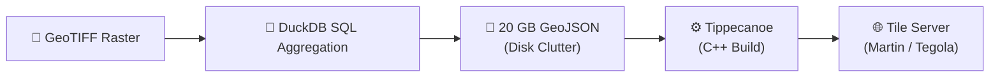
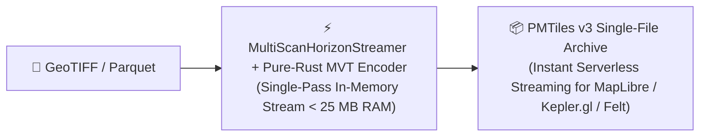

# Native PMTiles v3 Vector Hexagon Pyramids

[← Back to README](../README.md)

This document covers `raster_h3`'s native PMTiles v3 vector hexagon pyramid generation, multi-resolution zoom level mapping, leaf directory architecture, embedded statistical metadata, MapLibre GL JS integration, and the PMTiles Hexagon Studio web viewer.

## Motivation: Closing the Analytics-to-Visualization Gap
While DuckDB and `raster_h3` can aggregate hundreds of millions of raster pixels into H3 hexagonal summaries in seconds, **visualizing and serving** these massive spatial datasets to web clients has traditionally remained a slow, fragmented, and infrastructure-heavy bottleneck.

### Traditional 4-Step ETL Pipeline


### `raster_h3` Direct In-Memory Pipeline (Zero Intermediate Files)


## Why PMTiles v3 is the Ideal Web Mapping Target
* **Serverless Cloud-Native Distribution**: An entire multi-resolution pyramid of California or the Continental US lives in a **single `.pmtiles` archive**. You can host it on standard object storage (Amazon S3, Cloudflare R2, Google Cloud Storage, or GitHub Pages) with **zero running backend tile servers**.
* **HTTP Range-Request Streaming**: Modern web clients use HTTP `Range: bytes=...` headers to fetch only the specific few kilobytes of vector tile data needed for the user's immediate viewport and zoom level.
* **Instant Out-of-the-Box Client Compatibility**: Supported natively or via 1-line plugins in **MapLibre GL JS**, **Mapbox GL JS**, **Kepler.gl**, **Protomaps**, **Deck.gl**, and **Felt**.

## H3 Resolution to PMTiles Zoom Level Mapping
Because H3 uses an Aperture-7 hexagonal hierarchy (7x area reduction per step) while Web Mercator uses an Aperture-4 quadtree (4x area reduction per zoom level), the mathematical scaling ratio is:

Delta Zoom / Delta Resolution = log4(7) = 1.4037

To ensure optimal visual density on screen (150 to 2,500 hexagons per 512px tile) without WebGL frame drops, `raster_h3` maps H3 resolutions to Web Mercator zoom levels as follows:

| H3 Res (R) | Avg Hexagon Area | Avg Edge Length | Geographic Scale | Recommended PMTiles Zoom | Hexagons / 512px Tile |
| :---: | :---: | :---: | :--- | :---: | :---: |
| **Res 0** | 4,357,449 km² | 1,107 km | Global / Hemispheric | **Z0 – Z1** | ~10 – 30 |
| **Res 1** | 609,788 km² | 418 km | Continental | **Z2 – Z3** | ~30 – 100 |
| **Res 2** | 86,801 km² | 158 km | Sub-Continental | **Z3 – Z4** | ~50 – 200 |
| **Res 3** | 12,393 km² | 59.8 km | State / Province | **Z5 – Z6** | ~100 – 400 |
| **Res 4** | 1,770 km² | 22.6 km | Metropolitan Area | **Z7 – Z8** | ~200 – 600 |
| **Res 5** | 252.9 km² | 8.54 km | County / Large City | **Z8 – Z9** | ~300 – 900 |
| **Res 6** | 36.13 km² | 3.23 km | Municipal / Urban District | **Z10 – Z11** | ~400 – 1,200 |
| **Res 7** | 5.16 km² | 1.22 km | Neighborhood / Watershed | **Z11 – Z12** | ~500 – 1,500 |
| **Res 8** | 0.737 km² (73.7 ha) | 461 m | City Block | **Z13 – Z14** | ~600 – 1,800 |
| **Res 9** | 0.105 km² (10.5 ha) | 174 m | Parcel / Intersection | **Z14 – Z15** | ~700 – 2,200 |
| **Res 10** | 0.015 km² (1.5 ha) | 65.9 m | Building Footprint / Lot | **Z16 – Z17** | ~800 – 2,500 |

## PMTiles v3 Leaf Directory Architecture
For massive multi-resolution archives containing tens of thousands or millions of vector tiles, `raster_h3` automatically constructs **PMTiles v3 Leaf Directories**:
* **16 KB Root Fetch Budget**: The PMTiles v3 specification specifies that web clients (e.g. `pmtiles.js`) fetch only the first 16 KB (bytes 0 to 16383) during initialization to retrieve the archive header and root directory index.
* **4,096-Entry Leaf Chunks**: When tile counts exceed a single directory block, directory entries are partitioned into compressed leaf directory blocks (~4 to 8 KB each). The root directory retains lightweight pointer entries (`run_length = 0`, pointing to leaf byte offsets and lengths).
* **Instant Scalability**: Compressed root directories remain under 150 bytes regardless of dataset size (e.g., 60,000+ tiles compressed from 87 KB down to 122 bytes), ensuring instantaneous startup and sub-millisecond viewport tile lookups.

## Embedded Multi-Resolution Statistical Metadata (`h3_resolution_stats`)
`raster_h3` automatically embeds rich statistical envelopes across all pyramid levels directly inside the PMTiles JSON metadata:
```json
{
  "h3_resolution_stats": {
    "5": {
      "cell_count": 512,
      "zooms": [5, 6],
      "mean": { "min": 12.4, "max": 892.1, "avg": 341.2 },
      "purity": 0.942,
      "distinct_classes": { "min": 1, "max": 8, "avg": 1.4 }
    }
  }
}
```
This enables client applications to adaptively normalize color ramps, configure dynamic slider bounds, and inspect cross-resolution aggregation metrics without downloading raw feature data.

## MapLibre GL JS Integration Example
```javascript
import { Protocol } from 'pmtiles';
import maplibregl from 'maplibre-gl';

let protocol = new Protocol();
maplibregl.addProtocol('pmtiles', protocol.tile);

const map = new maplibregl.Map({
    container: 'map',
    style: 'https://demotiles.maplibre.org/style.json',
    center: [-122.4, 37.7],
    zoom: 10
});

map.on('load', () => {
    map.addSource('h3_raster', {
        type: 'vector',
        url: 'pmtiles://https://my-bucket.s3.amazonaws.com/california_elevation.pmtiles'
    });
    map.addLayer({
        id: 'h3_hexagons_layer',
        type: 'fill',
        source: 'h3_raster',
        'source-layer': 'h3_hexagons',
        paint: {
            'fill-color': [
                'interpolate', ['linear'], ['get', 'mean'],
                0, '#2b83ba',
                500, '#abdda4',
                1500, '#fdae61',
                3000, '#d7191c'
            ],
            'fill-opacity': 0.75,
            'fill-outline-color': 'rgba(255, 255, 255, 0.2)'
        }
    });
});
```

---

## PMTiles Hexagon Studio Web Viewer (`pmtiles_viewer`)

`raster_h3` includes a dedicated browser-based visual exploration studio in `pmtiles_viewer/` for inspecting both continuous and categorical H3 vector pyramids:

### 1. Launch with Docker Compose (Recommended)
The repository includes a configured `docker-compose.yml` that mounts the project root and serves the viewer with HTTP byte-range and CORS support:

```bash
# Start viewer in foreground
docker compose up viewer

# Or run in detached mode (background)
docker compose up -d viewer
```

### 2. Launch with Standalone Docker
If you prefer running a one-liner without Docker Compose:

```bash
docker run --rm -p 8080:8080 -v $(pwd):/app python:3.11-slim python3 -u /app/pmtiles_viewer/server.py 8080
```

### 3. Launch via Local Python Streaming Server
If you have Python 3 installed locally:

```bash
# Launch local server with HTTP byte-range and CORS support
python3 pmtiles_viewer/server.py 8080
```

### Accessing the Web Studio
Once running, open **`http://localhost:8080/pmtiles_viewer/`** (or **`http://localhost:8080`**) in your browser.
* **Loading Datasets**: In the left sidebar PMTiles path input, enter any PMTiles file relative to the repo root (e.g., `/data/CFL_HI_pyramid.pmtiles`, `/data/sample_sf.pmtiles`, or custom files created in `./data/`).
* **Instant Dynamic Streaming**: The viewer uses HTTP byte-range requests (`pmtiles.FetchSource`) to query only the necessary tile byte ranges on the fly without downloading the entire multi-gigabyte file.

### 4. Offline Mode via Local File Drag-and-Drop
If opening `pmtiles_viewer/index.html` directly from disk (`file:///`), Chrome blocks network HTTP fetch requests. You can click the left sidebar dropzone (**📁 Click to select file from disk**) or drag and drop any `.pmtiles` archive to load it 100% offline via the native browser `FileReader` API (`pmtiles.FileSource`).

### Viewer Features:
* **Dual Visualization Modes**: Auto-detects Continuous (mean, stddev, sum, min, max) vs. Categorical (majority class, purity, histogram, distinct classes) data.
* **Curated Color Palettes**: Built-in cartographic palettes (Viridis, Turbo, Magma, Plasma, Cividis, Inferno, Spectral, etc.).
* **LANDFIRE & Custom Category Schemes**: Preloaded LANDFIRE 40 Fire Behavior Fuel Models (FBFM40) classification scheme with live category label and color editing.
* **3D Hexagon Extrusion & Wireframe**: Real-time 3D volumetric extrusion scaled by physical quantities or majority class certainty.
* **Resolution-Adaptive Color Normalization**: Synchronizes slider ranges dynamically as you zoom across H3 pyramid levels.
