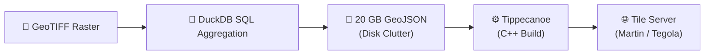
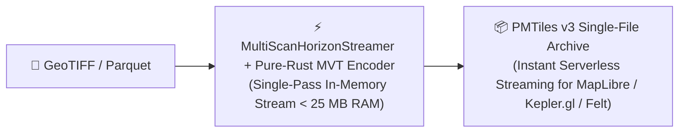

# PMTiles v3 & Multi-Resolution Hexagon Pyramids

[← Back to README](../README.md)

This document covers PMTiles v3 as a distribution format, why multi-resolution aggregation is essential for web maps, the Aperture-7 ground-truth challenge, zoom level mapping, leaf directory architecture, embedded metadata, and end-to-end deployment.

## What is PMTiles?

**PMTiles** is an open single-file archive format for tiled map data. A `.pmtiles` file contains an entire multi-zoom vector tile pyramid — every tile for every zoom level — in one contiguous file. Web clients stream individual tiles on demand using HTTP `Range: bytes=...` requests, fetching only the few kilobytes needed for the current viewport.

This eliminates the traditional serving stack entirely:

| Approach | What You Need |
| :--- | :--- |
| **Folder of `.pbf` files** | Web server, directory structure of 100k+ files |
| **MBTiles (SQLite)** | Tile server (Martin, Tegola, TileServer GL) |
| **PMTiles v3** | **Nothing** — upload to S3, R2, or GitHub Pages and serve directly |

> 📖 **Specification**: [PMTiles v3 Spec](https://github.com/protomaps/PMTiles/blob/main/spec/v3/spec.md)

## Motivation: Closing the Analytics-to-Visualization Gap

While DuckDB and `raster_h3` can aggregate hundreds of millions of raster pixels into H3 hexagonal summaries in seconds, **visualizing and serving** these massive spatial datasets to web clients has traditionally remained a slow, fragmented, and infrastructure-heavy bottleneck.

### Traditional 4-Step ETL Pipeline


### `raster_h3` Direct In-Memory Pipeline (Zero Intermediate Files)


## Why Multi-Resolution Matters for Web Maps

A web map spans zoom level 0 (the entire planet) down to zoom level 15+ (individual parcels). Each zoom level needs hexagons at a matching spatial density — coarse H3 resolution 5 cells for the state-level overview, fine resolution 8 cells for the neighborhood view. Without multi-resolution support, you'd need to run the raster aggregation **N separate times** — once per zoom level — and stitch the results together.

`raster_h3` builds the entire multi-resolution pyramid in a **single pass** over the raster. It reads each pixel once and simultaneously aggregates it into every requested H3 resolution, streaming results directly into the PMTiles archive:

```sql
-- Single-pass multi-resolution PMTiles export: resolutions 5 through 8
SELECT * FROM h3_raster_to_pmtiles(
    'california_dem_30m.tif', 'california_elevation.pmtiles',
    min_resolution := 5, max_resolution := 8, sampling := 'rgss'
);
```

This produces a `.pmtiles` archive that is fully zoomable — from state-level overview down to city-block detail — without rereading the input file.

## The Aperture-7 Challenge & Ground-Truth Guarantee

Building multi-resolution pyramids for H3 is harder than for standard quadtree tile systems because H3 uses an **Aperture-7** hierarchy: each parent hexagon contains 7 child hexagons, but the children are **rotated** relative to the parent. This means parent hexagons are *not* the strict geometric union of their children — child boundaries slightly overlap neighboring parent boundaries.


As a result:
* **Naive Parent Rollups (`cell.parent()`)**: Suffer from boundary distortion near cell edges because child hexagons slightly overlap neighboring parent boundaries. Rolling up child statistics introduces spatial error that compounds at coarser resolutions.
* **`raster_h3` Direct Multi-Resolution Streaming**: Evaluates every pixel's exact coordinate center against the true polygon boundary of every requested resolution level simultaneously. No rollups, no approximation.

> [!TIP]
> **100.000% Exact Numerical Identity**: Running multi-resolution extraction on `[7, 8, 9]` produces cell indices, pixel counts, means, variances, mins, and maxes that are **100% identical** down to the exact pixel compared to running three separate single-resolution scans.

### Multi-Resolution SQL Examples

**Continuous** — elevation across resolutions 7, 8, and 9:
```sql
SELECT 
    resolution,
    h3_hex,
    round(mean, 2) AS mean_elevation,
    round(stddev, 2) AS ruggedness,
    count AS pixels
FROM h3_raster_continuous_aggregate(
    'california_dem.tif',
    resolutions := [7, 8, 9]
)
ORDER BY resolution ASC, pixels DESC;
```

**Categorical** — land cover across resolutions 7 and 8:
```sql
SELECT
    resolution,
    h3_hex,
    majority_class,
    round(majority_fraction * 100, 1) AS dominance_pct,
    unique_classes
FROM h3_raster_categorical_aggregate(
    'nlcd_landcover_2021.tif',
    resolutions := [7, 8]
)
ORDER BY resolution ASC, dominance_pct DESC;
```

## H3 Resolution to PMTiles Zoom Level Mapping

Because H3 uses an Aperture-7 hexagonal hierarchy (7x area reduction per step) while Web Mercator uses an Aperture-4 quadtree (4x area reduction per zoom level), the mathematical scaling ratio is:

$$\Delta \text{Zoom} / \Delta \text{Resolution} = \log_4(7) \approx 1.4037$$

To ensure optimal visual density on screen (150 to 2,500 hexagons per 512px tile) without WebGL frame drops, `raster_h3` maps H3 resolutions to Web Mercator zoom levels as follows:

| H3 Res (R) | Avg Hexagon Area | Avg Edge Length | Geographic Scale | Recommended PMTiles Zoom | Hexagons / 512px Tile |
| :---: | :---: | :---: | :--- | :---: | :---: |
| **Res 0** | 4,357,449 km² | 1,107 km | Global / Hemispheric | **Z0 – Z1** | ~10 – 30 |
| **Res 1** | 609,788 km² | 418 km | Continental | **Z2 – Z3** | ~30 – 100 |
| **Res 2** | 86,801 km² | 158 km | Sub-Continental | **Z3 – Z4** | ~50 – 200 |
| **Res 3** | 12,393 km² | 59.8 km | State / Province | **Z5 – Z6** | ~100 – 400 |
| **Res 4** | 1,770 km² | 22.6 km | Metropolitan Area | **Z7 – Z8** | ~200 – 600 |
| **Res 5** | 252.9 km² | 8.54 km | County / Large City | **Z8 – Z9** | ~300 – 900 |
| **Res 6** | 36.13 km² | 3.23 km | Municipal / Urban District | **Z10 – Z11** | ~400 – 1,200 |
| **Res 7** | 5.16 km² | 1.22 km | Neighborhood / Watershed | **Z11 – Z12** | ~500 – 1,500 |
| **Res 8** | 0.737 km² (73.7 ha) | 461 m | City Block | **Z13 – Z14** | ~600 – 1,800 |
| **Res 9** | 0.105 km² (10.5 ha) | 174 m | Parcel / Intersection | **Z14 – Z15** | ~700 – 2,200 |
| **Res 10** | 0.015 km² (1.5 ha) | 65.9 m | Building Footprint / Lot | **Z16 – Z17** | ~800 – 2,500 |

## PMTiles v3 Leaf Directory Architecture

For massive multi-resolution archives containing tens of thousands or millions of vector tiles, `raster_h3` automatically constructs **PMTiles v3 Leaf Directories**:
* **16 KB Root Fetch Budget**: The PMTiles v3 specification specifies that web clients (e.g. `pmtiles.js`) fetch only the first 16 KB (bytes 0 to 16383) during initialization to retrieve the archive header and root directory index.
* **4,096-Entry Leaf Chunks**: When tile counts exceed a single directory block, directory entries are partitioned into compressed leaf directory blocks (~4 to 8 KB each). The root directory retains lightweight pointer entries (`run_length = 0`, pointing to leaf byte offsets and lengths).
* **Instant Scalability**: Compressed root directories remain under 150 bytes regardless of dataset size (e.g., 60,000+ tiles compressed from 87 KB down to 122 bytes), ensuring instantaneous startup and sub-millisecond viewport tile lookups.

## Embedded Multi-Resolution Statistical Metadata (`h3_resolution_stats`)

`raster_h3` automatically embeds rich statistical envelopes across all pyramid levels directly inside the PMTiles JSON metadata:
```json
{
  "h3_resolution_stats": {
    "5": {
      "cell_count": 512,
      "zooms": [5, 6],
      "mean": { "min": 12.4, "max": 892.1, "avg": 341.2 },
      "purity": 0.942,
      "distinct_classes": { "min": 1, "max": 8, "avg": 1.4 }
    }
  }
}
```
This enables client applications to adaptively normalize color ramps, configure dynamic slider bounds, and inspect cross-resolution aggregation metrics without downloading raw feature data.

## What Can You Do With a `.pmtiles` File?

| Use Case | How |
| :--- | :--- |
| **Host a serverless web map** | Upload to Amazon S3, Cloudflare R2, Google Cloud Storage, or GitHub Pages. No tile servers, no Docker, no infrastructure. |
| **View offline** | Drag and drop into the [Hexagon Studio](../pmtiles_viewer/README.md) web viewer — works entirely client-side with no server or network connection. |
| **Embed in dashboards** | Add as a MapLibre GL JS vector source. Embedded `h3_resolution_stats` auto-calibrate color ramps and slider bounds. |
| **Share with stakeholders** | Email or Slack a single file. Recipients open it in any PMTiles-compatible viewer. |
| **Version your maps** | `.pmtiles` files are immutable snapshots — ideal for Git LFS, S3 versioning, or CI/CD artifact pipelines. |

**Supported clients**: [MapLibre GL JS](https://maplibre.org/), [Mapbox GL JS](https://www.mapbox.com/), [Kepler.gl](https://kepler.gl/), [Protomaps](https://protomaps.com/), [Deck.gl](https://deck.gl/), and [Felt](https://felt.com/).

## End-to-End Walkthrough: GeoTIFF to Live Web Map

### Step 1 — Aggregate the Raster into PMTiles

```sql
SELECT * FROM h3_raster_to_pmtiles(
    'nlcd_landcover_2021.tif',
    'landcover.pmtiles',
    min_resolution := 5,
    max_resolution := 8,
    categorical := true,
    sampling := 'rgss'
);
```

### Step 2 — Upload to Cloud Storage

```bash
# Amazon S3
aws s3 cp landcover.pmtiles s3://my-maps-bucket/landcover.pmtiles

# Cloudflare R2
wrangler r2 object put my-maps-bucket/landcover.pmtiles --file landcover.pmtiles

# Or simply commit to a GitHub Pages repository
```

### Step 3 — Display in MapLibre GL JS

```javascript
import { Protocol } from 'pmtiles';
import maplibregl from 'maplibre-gl';

let protocol = new Protocol();
maplibregl.addProtocol('pmtiles', protocol.tile);

const map = new maplibregl.Map({
    container: 'map',
    style: 'https://demotiles.maplibre.org/style.json',
    center: [-122.4, 37.7],
    zoom: 10
});

map.on('load', () => {
    map.addSource('h3_raster', {
        type: 'vector',
        url: 'pmtiles://https://my-maps-bucket.s3.amazonaws.com/landcover.pmtiles'
    });
    map.addLayer({
        id: 'h3_hexagons_layer',
        type: 'fill',
        source: 'h3_raster',
        'source-layer': 'h3_hexagons',
        paint: {
            'fill-color': [
                'interpolate', ['linear'], ['get', 'mean'],
                0, '#2b83ba',
                500, '#abdda4',
                1500, '#fdae61',
                3000, '#d7191c'
            ],
            'fill-opacity': 0.75,
            'fill-outline-color': 'rgba(255, 255, 255, 0.2)'
        }
    });
});
```

That's it — GeoTIFF to interactive, zoomable web map in three steps.

---

## PMTiles Hexagon Studio Web Viewer

`raster_h3` includes a browser-based visual exploration studio for inspecting continuous and categorical H3 vector pyramids. It runs entirely client-side via MapLibre GL JS with HTTP byte-range streaming or offline drag-and-drop.

> 📖 **Full viewer documentation** — See [pmtiles_viewer/README.md](../pmtiles_viewer/README.md) for launch methods, data schemas, studio controls, and features.
